<div align="center">

# myTwin

### Meet Dash. Understand your energy. Make a plan you can actually follow.

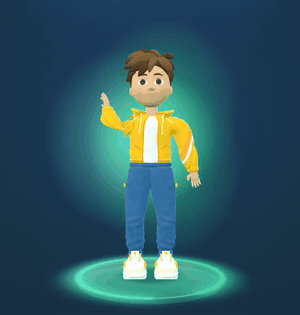


Built for the RevenueCat Shipaton 2026 · Next Gen Award

</div>

myTwin turns sleep, activity, calendar events and your own goals into a practical daily plan.
**Dash**, an animated 3D companion, shows your estimated energy. Free includes check-ins,
activity, goals and your calendar. **Pro** adds forecasts, scheduling, Rescue my day and a
spoken **Gemini mentor conversation** that you can answer by talking or typing.

The energy percentage and hourly curve are **rough estimates**, not measurements of a
body battery or medical advice. Your own check-in can adjust the plan.

<p align="center">
  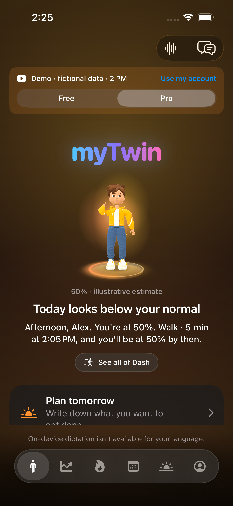
  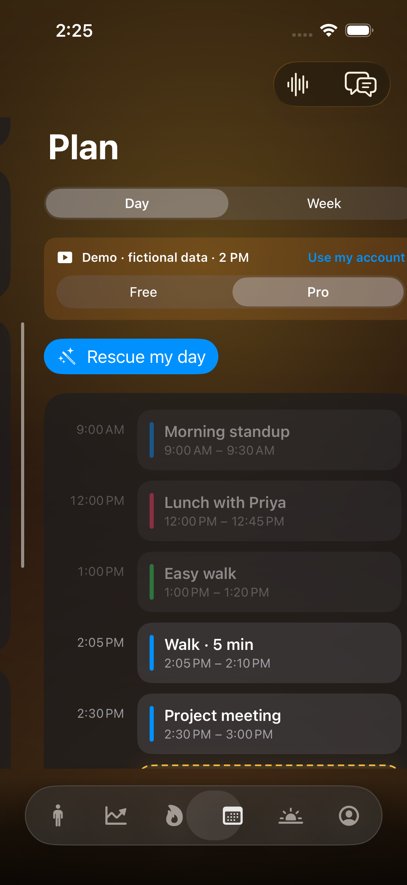
  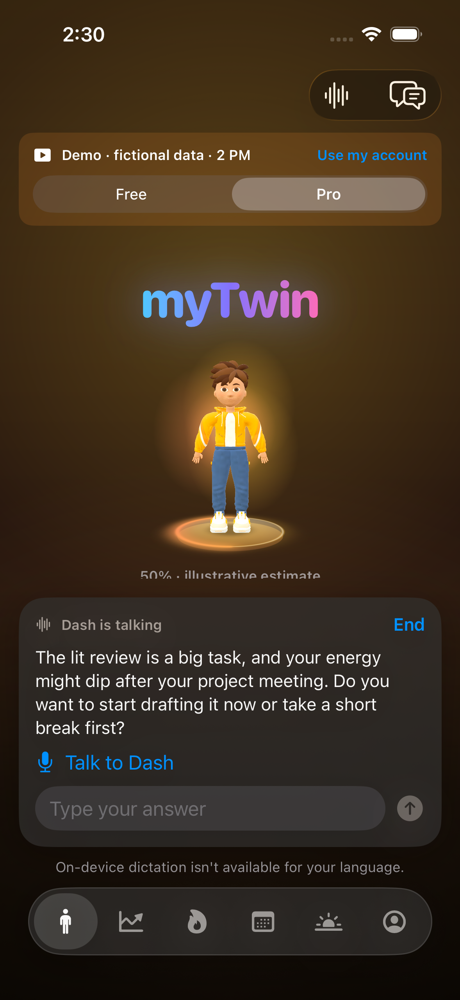
</p>

## Start here

- [Judges: five-minute walkthrough](#judges-five-minute-walkthrough)
- [Run the app](#run-the-app)
- [Guest demo: Free and Pro](#guest-demo-free-and-pro)
- [Set up your own account](#set-up-your-own-account)
- [Use every feature](#use-every-feature)
- [Free versus Pro](#free-versus-pro)
- [Configure integrations](#configure-integrations)
- [Privacy and calendar writes](#privacy-and-calendar-writes)
- [Troubleshooting](#troubleshooting)
- [Testing and screenshots](#testing-and-screenshots)
- [Meet Dash](#meet-dash)
- [Honest limits](#honest-limits)
- [Project layout](#project-layout)

## Judges: five-minute walkthrough

The guest demo uses a fictional person, **Alex**, and a fixed **2 PM** day. No wearable,
personal health records or purchase is needed to try the app.

1. Build and run using the instructions below.
2. Choose **Continue as a guest → Continue without Pro**. Look at Dash and the locked
   forecast/planning features.
3. Switch the demo banner to **Pro**. Open **Predictions** for the hourly forecast and week story.
4. Open **Plan → Week**, then tap a day to see its events. Return to today's plan.
5. Choose **Rescue my day → Preview my rescue → Confirm demo change**. Look at the result
   and try **Undo change**. Only the fictional calendar changes.
6. Open **Tomorrow**. Add or edit a goal for today, tick one off, and select **Plan the rest
   of today**. Write tomorrow's goals and choose **Plan my day tomorrow**.
7. Scroll to tomorrow's prediction and change expected sleep. The outlook is a **what-if**,
   based on assumed typical sleep quality and heart rate.
8. Open **You → Make it yours** and **Dash's voice**. Compare Free and Pro again.
9. Optional, with a Gemini key and your permission: tap **Start conversation** on Dash or let Dash start a Pro check-in. Type a reply on
   Simulator, or speak on a supported iPhone. Ask for a calendar change and review **Confirm**.
10. Tap **Use my account** to explore personal setup. The demo switch is not a real subscription.

## Run the app

### Simulator: quickest route

Requirements: a Mac with **Xcode 26 or later**, an installed **iOS 26 or later** Simulator,
and internet access to download the RevenueCat Swift package. There is no separate server
to start, and you do not need CocoaPods.

```sh
git clone https://github.com/aditya-baniya-ai/myTwin.git
cd myTwin
open myTwin.xcodeproj
```

1. Wait for Xcode to download the Swift packages the app needs.
2. Select the **myTwin** scheme and an installed iPhone Simulator.
3. Press **⌘R**. Choose the guest option on the welcome screen.
4. To start directly in the demo next time, open **Product → Scheme → Edit Scheme → Run → Arguments**.
   Add `--sample-day` for Pro or `--demo-free` for Free. Remove these arguments to use personal mode.

No private Gemini key is required for the visual demo. The repository includes a **public
RevenueCat Test Store SDK key**. Gemini chat and the mentor do require your own Gemini key.
We could not test Apple's on-device chat or voice input in our Simulator setup.

| Capability | Simulator | Supported iPhone |
|---|---|---|
| Guest Free/Pro, Dash, calendar, goals, Rescue, settings | Yes | Yes |
| Typed Gemini replies and mentor interface | With a key, permission and internet | With a key, permission and internet |
| Voice input and hands-free reply timing | Not supported in the tested Simulator | Microphone/speech permission and supported language required |
| Apple Foundation Models answers | Unavailable in the tested Simulator | Apple Intelligence support and model availability required |
| Your own Health data and wearable syncing | No real phone/watch records | With Health access and records from your sources |
| Home Screen widget / Live Activity | Can be previewed; phone testing is still needed | Subject to iOS settings and update scheduling |

### Your iPhone

1. Connect and unlock your iPhone; trust the Mac if prompted.
2. In Xcode's app and widget targets, choose your development **Team** and unique bundle IDs.
3. Match the **App Group** in both targets and `Shared/TwinState.swift`.
4. Keep the app's HealthKit capability, permission descriptions and widget extension.
   Let Xcode manage signing. Fix any signing or capability errors shown for your team.
5. Select your iPhone and run. Enable **Developer Mode** and trust the development build if iOS asks.
6. Follow personal setup below, or open the guest demo first.

Apple's [device and Simulator running guide](https://developer.apple.com/documentation/Xcode/running-your-app-on-simulated-or-physical-devices)
explains the device/signing workflow. App Store distribution needs its own production signing,
store configuration and review; changing a key alone is not a release process.

## Guest demo: Free and Pro

<p align="center">
  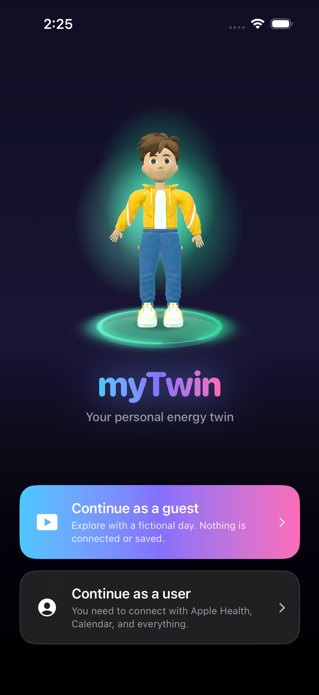
  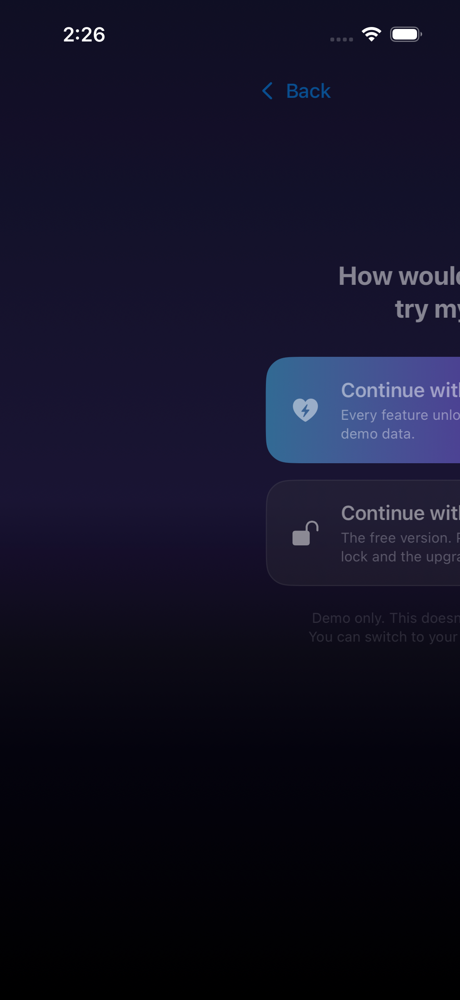
</p>

1. Tap **Continue as a guest**.
2. Choose **Continue without Pro** or **Continue with Pro**.
3. Every main page shows **Demo · fictional data · 2 PM**. Use **Free / Pro** to compare which features each includes.
4. Try calendar changes, goal planning and weight entry: the demo keeps fictional data in memory for that session.
5. Tap **Use my account** to leave. From personal mode, return through **You → Try the demo**.

Demo health, calendar and goals are separate from your real records. Voice preferences and
Gemini permission are app settings; the demo is not a separate cloud login. Enabling Gemini
allows demo questions and the fictional records Dash uses to answer them to be sent to Google.

### Free demo

Start with check-ins, your calendar, activity and goal tracking. Forecast and scheduling
buttons ask you to upgrade. When Dash starts a check-in, his card offers **Tell me more / Not now**.

<p align="center">
  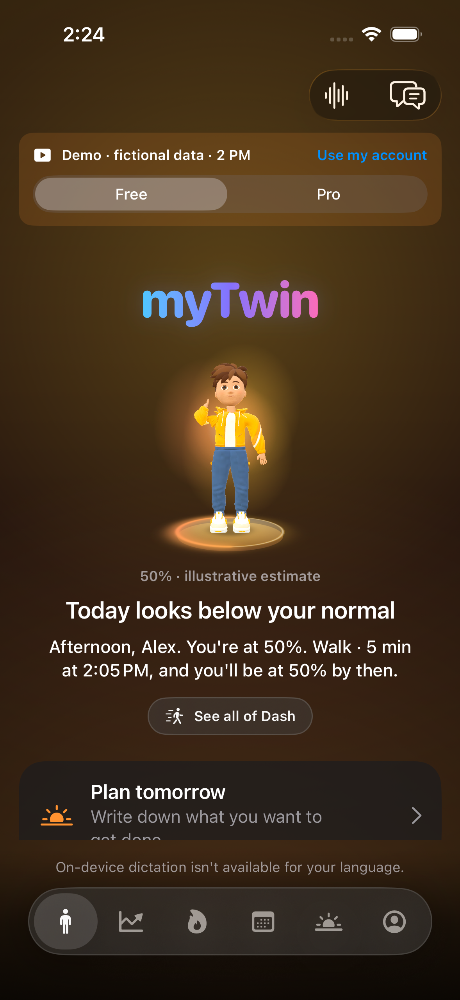
  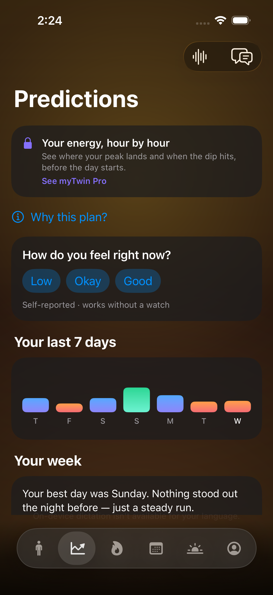
  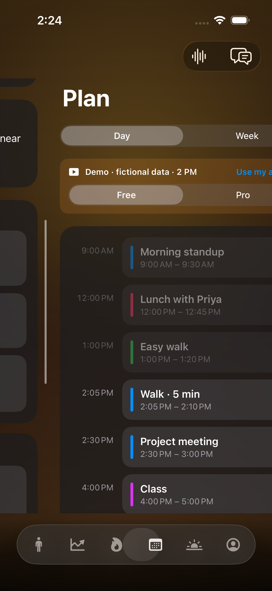
</p>

### Pro demo

Pro adds forecasts, suggestions, Rescue and goal scheduling to the same fictional day.
You can also talk to Dash when Gemini is set up and allowed. Trying Pro in the demo does
not charge you or activate a paid subscription for your personal profile.

<p align="center">
  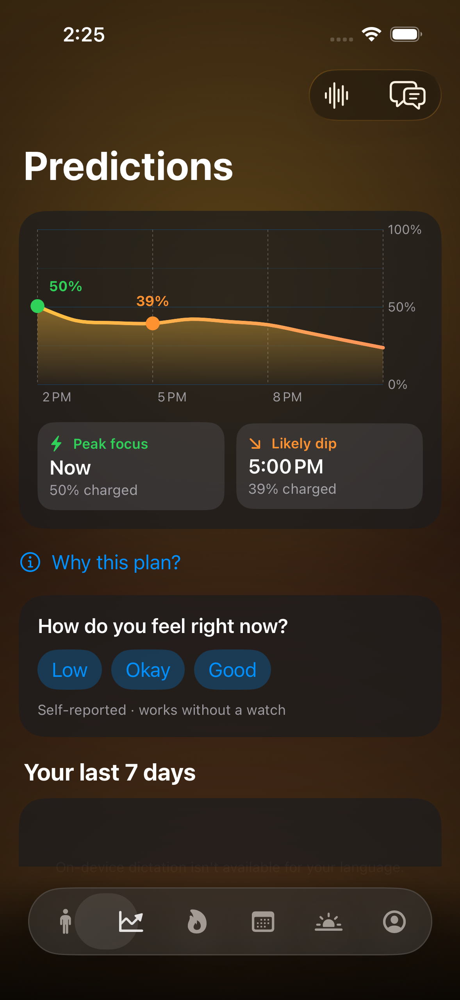
  
  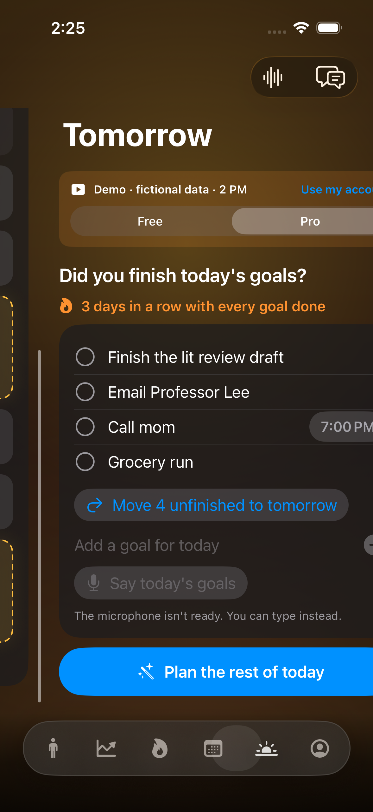
</p>

## Set up your own account

“Your account” is a **profile saved on your device**. You do not sign in with an email or
password. This version does not offer cloud sign-in or sync your profile between devices.

1. Choose **Continue as a user**, or **Use my account** from the demo.
2. Enter your name and age, then tap **Continue**.
3. Select **Connect Apple Health** and allow the records you want to use.
4. Select **Connect Calendar** so the app can read events and save your plans.
5. Continue. You may use **Continue anyway** and connect missing sources later under **You**.
6. Decide whether to allow Gemini. This is separate from Health and Calendar permissions.
7. Open **You → Make it yours**, choose your preferences, then **Save**.
8. Start with a check-in. An energy forecast based on your records needs today's sleep and at least
   seven usable nights from the last 14 days. The app does not make up missing records.

The screenshots below show **personal-account mode with a clean sample profile**, not the
author's private health or calendar records. A connected physical phone is needed to capture
those records; the phone was unavailable during this documentation run.

<p align="center">
  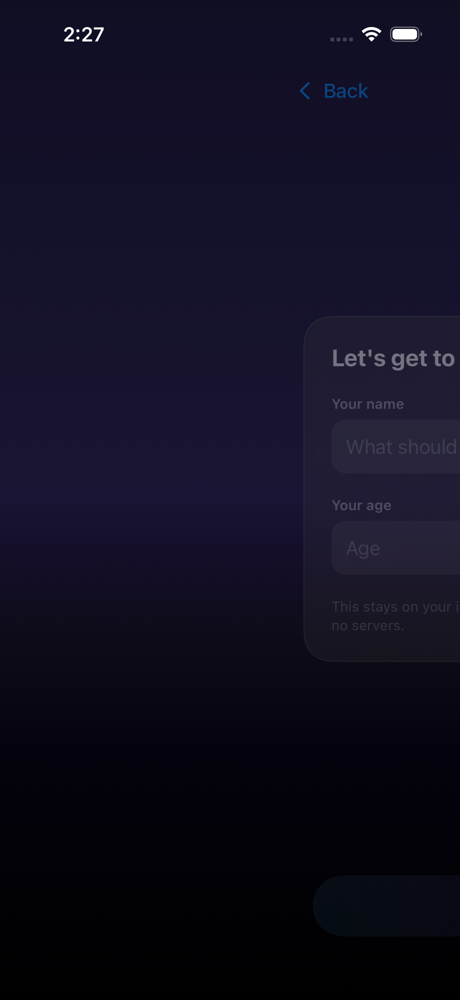
  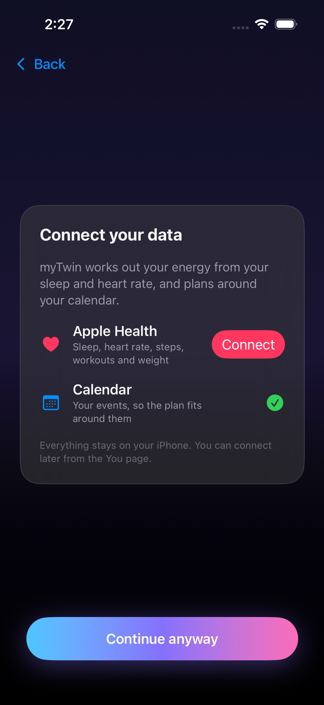
  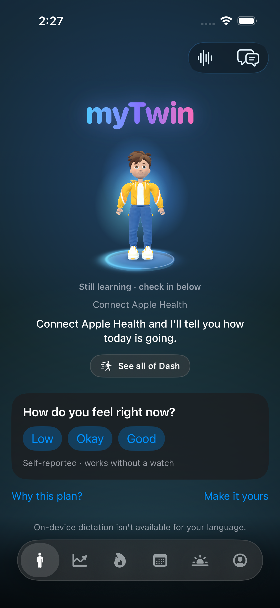
</p>
<p align="center">
  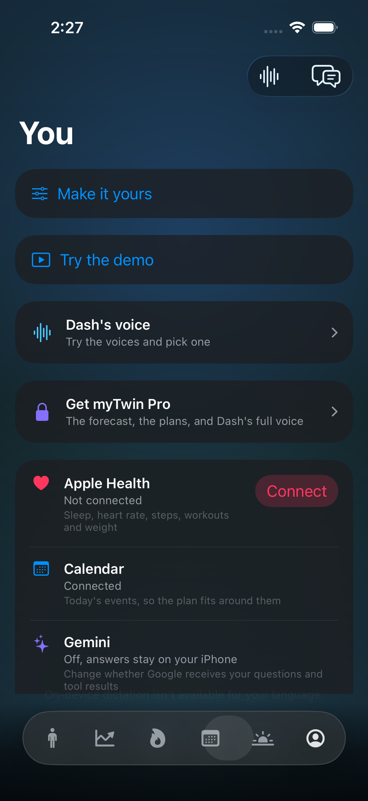
  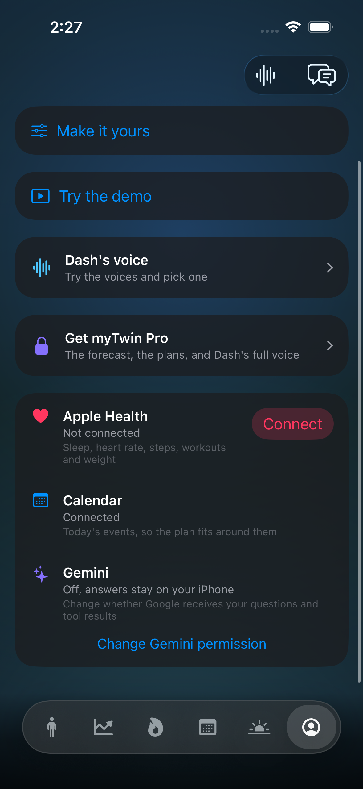
</p>

### Personal Pro: the same features outside the demo

The screenshots below are from **personal mode with a simulated Pro subscription through RevenueCat Test Store**.
They use a clean sample profile, not private phone data. The purchase was simulated, and no
personal records were sent to Gemini for this test.

- **Plan tomorrow** is visible all day. The Tomorrow tab works in both modes.
- **Start conversation** is available on Dash. Pro users can start without waiting for an
  automatic check-in or an energy forecast. Gemini still needs a key, your permission and internet.
- Add at least one goal to enable **Plan my day tomorrow**. The empty personal-profile
  screenshot shows the button disabled because there are no goals yet.
- Buying or restoring a verified subscription updates Pro access immediately. The guest
  Free/Pro switch does not activate your personal subscription.

<p align="center">
  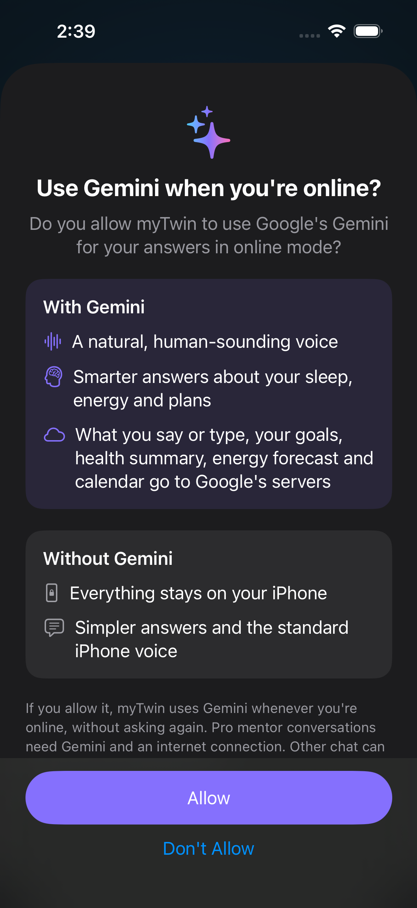
  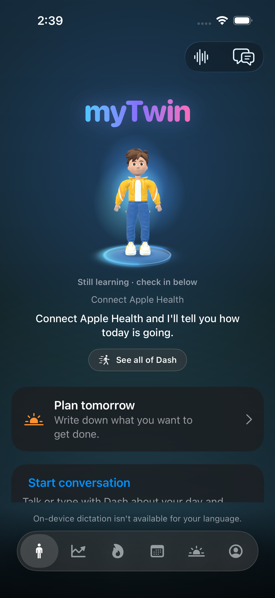
  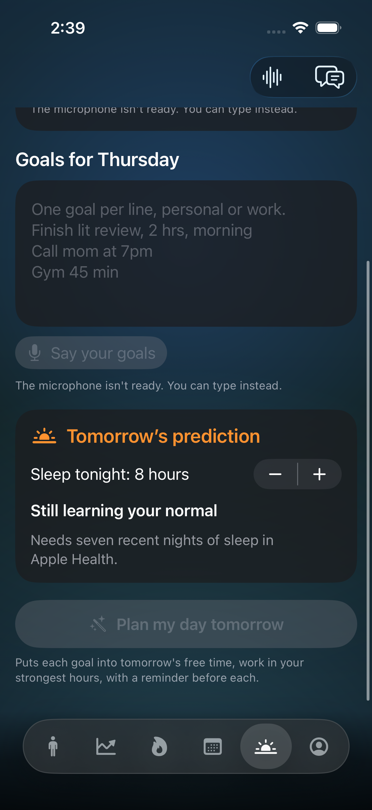
  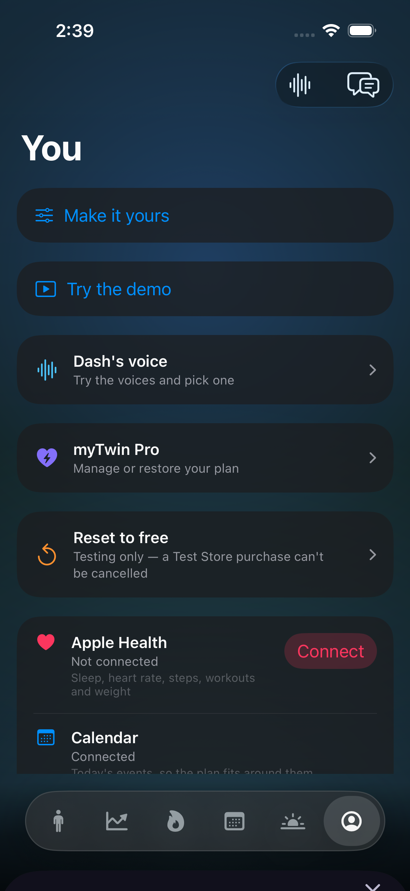
  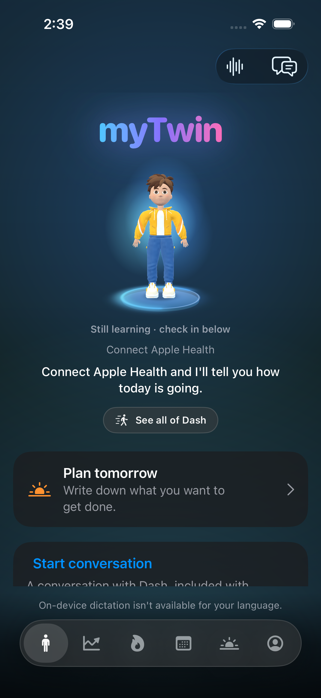
</p>

## Use every feature

The bottom bar has **six tabs**: Dash, Predictions, Activity, Plan, Tomorrow and You.
The chat button opens a conversation; it is not a seventh bottom tab.

### 1. Dash, check-ins and energy states

Open **Dash** for the day's estimate, greeting and next event. Drag Dash to rotate him;
tap him to start speaking on a supported device. **See all of Dash** opens the character
showcase with states and gestures. The app also has different icons for its energy states.

When **How do you feel right now?** appears, tap **Low**, **Okay** or **Good**. The card steps
aside and your answer adjusts suggestions without changing measured sleep. Check-ins appear again
at different times of day. They are useful even while the model is still learning.

### 2. Predictions and the week's story

Open **Predictions**. Pro sees peak focus, the likely dip and the hourly curve. Scroll for
the week's story and **You often ask**. The week recap describes better/harder days and
patterns using available records; it cannot explain the medical reason for a change.

Choose **Why this plan?** to see the records used, estimates, missing history and the option
to report how you actually feel. A shared hourly curve is an illustration, not a sensor reading.

<p align="center">
  
  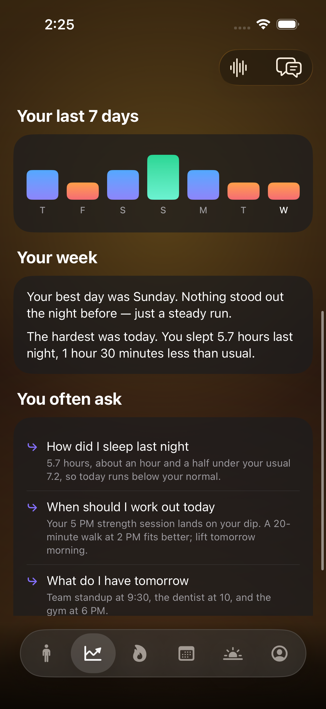
  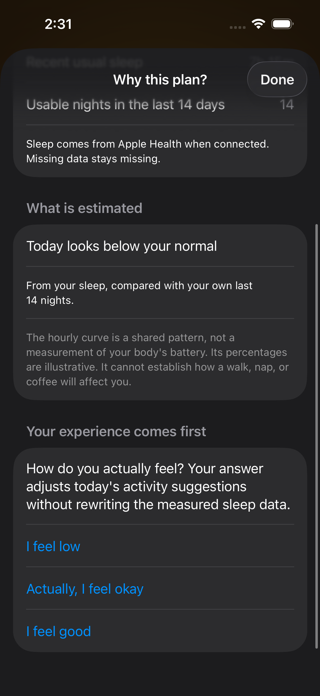
</p>

### 3. Activity, health coverage and weight

Open **Activity** for steps, active energy, sleep and weight. Scroll for Heart & Body,
movement, workouts and nutrition **when those records are available**. Available tiles include
heart rate, resting HR, HRV, VO₂ max, respiratory rate, mindful minutes, flights, distance,
stand hours, workout duration/calories/distance, and dietary energy/protein/carbs/fat.
If a reading is missing, the app leaves it out instead of making up a value.

Tap the weight card to **Log weight** in pounds. In personal mode, saving requires Health
write permission; in the demo it stays in the fictional session. Set optional targets in
**Make it yours**. Weight does not affect the energy forecast.

**You → What myTwin can read** shows which records are available. Wearables and nutrition apps feed
myTwin through Apple Health; there is no separate Garmin or MyFitnessPal login in myTwin.

<p align="center">
  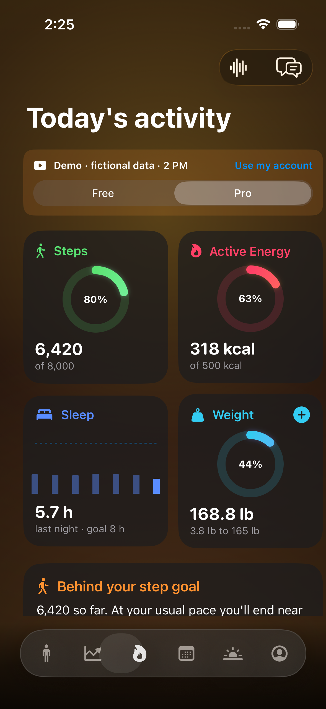
  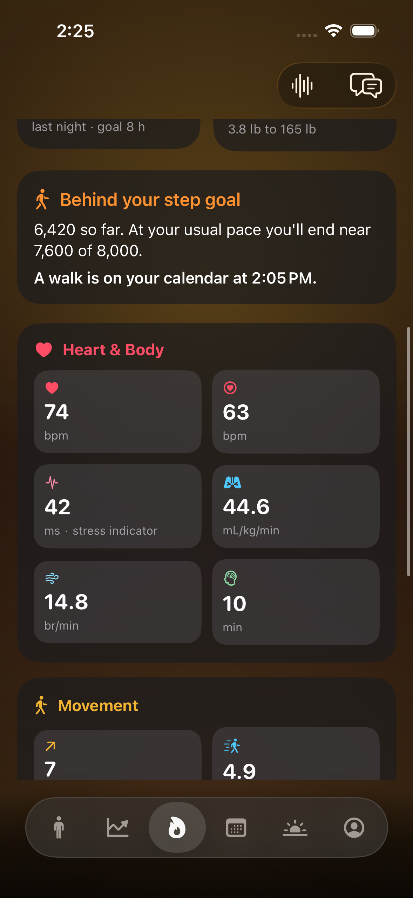
</p>

### 4. Step pace and optional automatic walks

Set a **Step goal** in **You → Make it yours**. **Activity** estimates the end-of-day total
from steps so far and your usual remaining activity. Enable **Add walks when I'm behind**
to allow short walks to be added to a free calendar gap.

Once you turn this feature on, it can add a walk automatically; it does **not** use the chat Confirm
button. Checks are spaced about two hours apart, limited to three walks per day, with at
most one pending walk and no night-time scheduling. Health sync and iOS background timing
can delay checks. Turn the setting off to stop adding walks automatically.

### 5. Day, week and individual calendar days

Open **Plan → Day** for timed rows and all-day events. Free sees existing events; Pro adds
suggestions in free gaps when a forecast is available. **Week** shows the next seven days;
tap a day to expand it, then tap **Week** to go back. Other days show their calendar events,
not today's energy suggestions.

Suggestions may include movement, a nap, caffeine timing and wind-down. Dismiss unwanted
suggestions; repeated dismissals influence future suggestions.

<p align="center">
  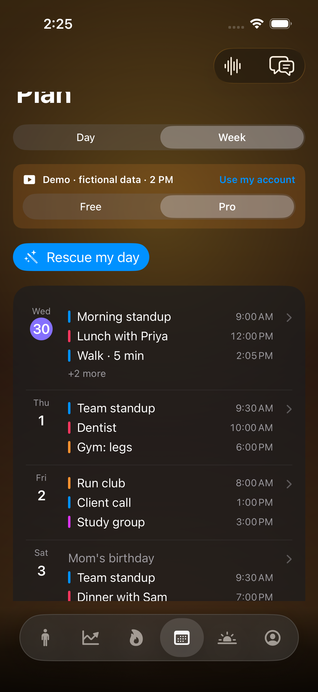
  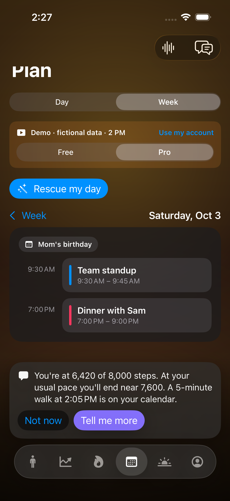
</p>

### 6. Rescue my day — Pro

1. Open **Rescue my day** from Dash or Plan.
2. Select an existing flexible activity or **Add a new flexible activity**.
3. Pick the activity and duration. Optionally enable **Choose the time**.
4. Tap **Preview my rescue**. Read the proposed before/after and explanation.
5. Tap **Confirm demo change** in the demo, or **Confirm calendar change** in personal mode.
6. Use **Undo change** on the dashboard if you want to reverse the rescue.

Rescue keeps fixed appointments in place. It only changes activities managed by myTwin
that are shown in the preview. It changes your plan, not your measured energy. If your chosen time is busy, the activity may
move to the next free slot. The preview explains this.

<p align="center">
  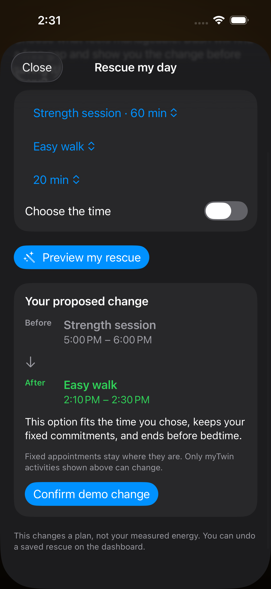
  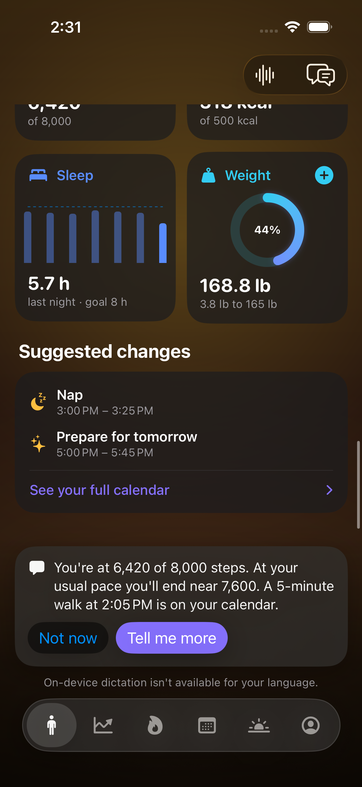
</p>

### 7. Feedback and Up next

After an app-suggested activity ends, answer **Better**, **Same**, **Worse** or **I skipped it**.
Your feedback can change future suggestions. The app tells you when it only has a few responses.
After answering, **Up next** shows the next event and a short tip for that activity. Feedback stays
on your device. It does not prove that an activity changed your health.

### 8. Today's goals, editing, completion and streaks

Open **Tomorrow**: the top of this page also manages **today**.

1. Use **Add a goal for today** or **Say today's goals**.
2. Include a duration/time if useful: `Finish report, 2 hrs` or `Call mom at 7pm`.
3. Tap a goal's name to edit its title, duration, category or time; use **Save**. The editor
   also offers **Delete goal**.
4. Tap the check circle to mark it done. Completed days build a streak; Dash celebrates
   finishing the last goal.
5. Use **Move … unfinished to tomorrow** to carry unfinished work forward.
6. With Pro, tap **Plan the rest of today** to schedule remaining goals around today's events.

<p align="center">
  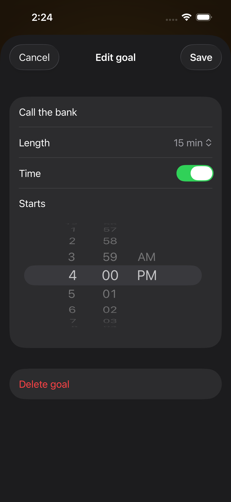
  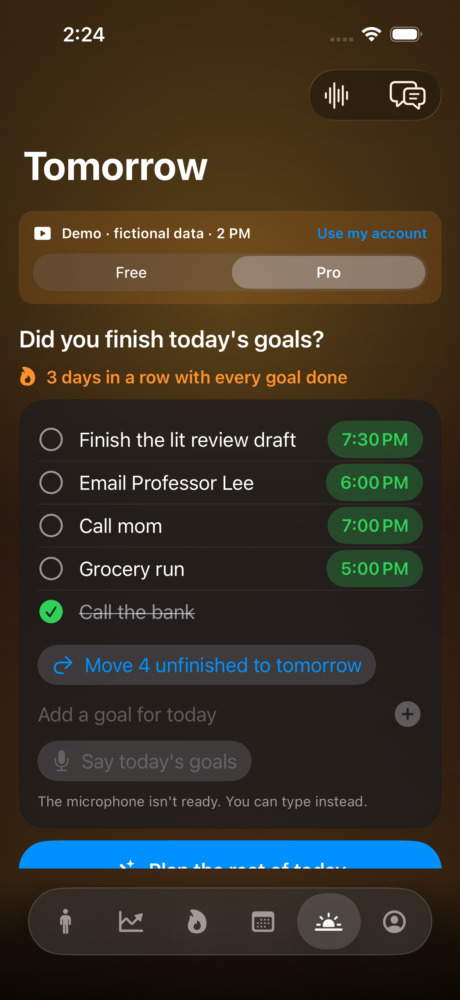
  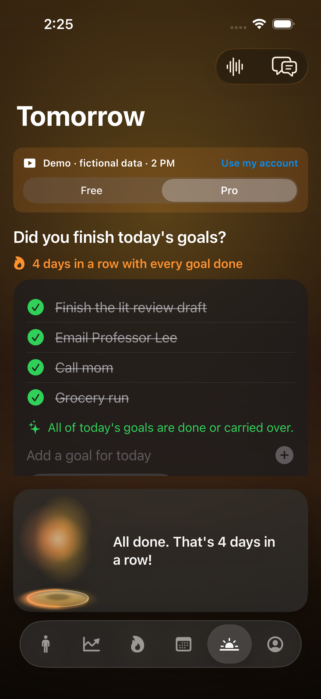
</p>

### 9. Tomorrow's goals and changing planned times — Pro scheduling

1. In **Tomorrow**, scroll to **Goals for …** and write one goal per line.
2. Add lengths or times naturally: `Finish lit review, 2 hrs, morning`, `Call mom at 7pm`,
   `Gym 45 min`. Or tap **Say your goals**, speak, and finish the recording.
3. Review the text. The app separates your spoken goals on your device, using only words you actually said.
4. Tap **Done** to close the keyboard.
5. Pro: tap **Plan my day tomorrow**. This saves the planned goals to your calendar
   right away. You do not need to tap a second Confirm button as you do in chat.
6. Tap a planned time, adjust it, then **Save**. Planning again keeps your chosen times and
   tells you whether it added anything. The app points out overlapping times.

Free can write, edit, complete and carry goals; scheduling opens the Pro paywall. Planned
goals receive event reminders, and permitted notifications provide a morning list and an
evening completion reminder. **Plan tomorrow** is available on Dash all day, in both personal and demo modes.

<p align="center">
  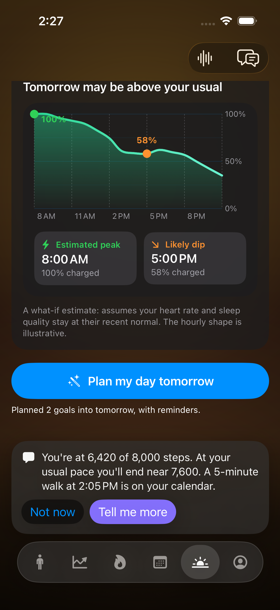
  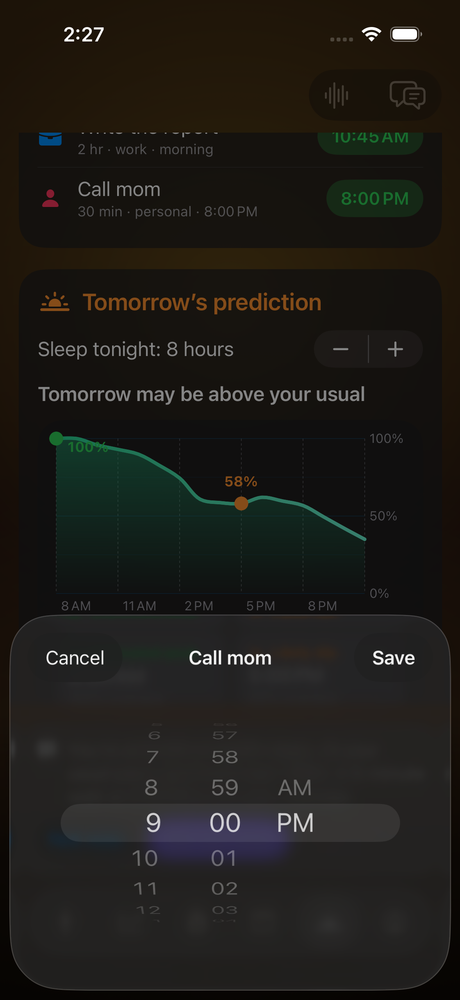
  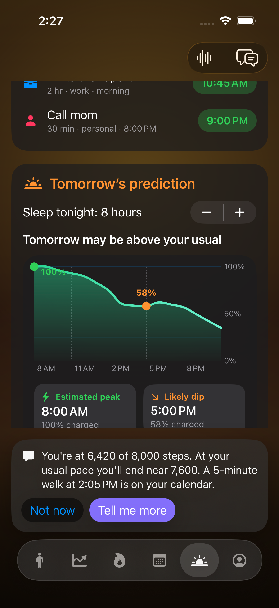
</p>

### 10. Tomorrow's sleep what-if — Pro

Scroll to tomorrow's outlook. Change expected sleep with the stepper and compare the result.
It uses the shipped model with assumed typical sleep quality/stages and resting heart rate.
It needs seven recent usable nights; otherwise it says **Still learning**. It is not a
proven prediction of how your body will feel tomorrow. It does not change Apple Health records.

<p align="center">
  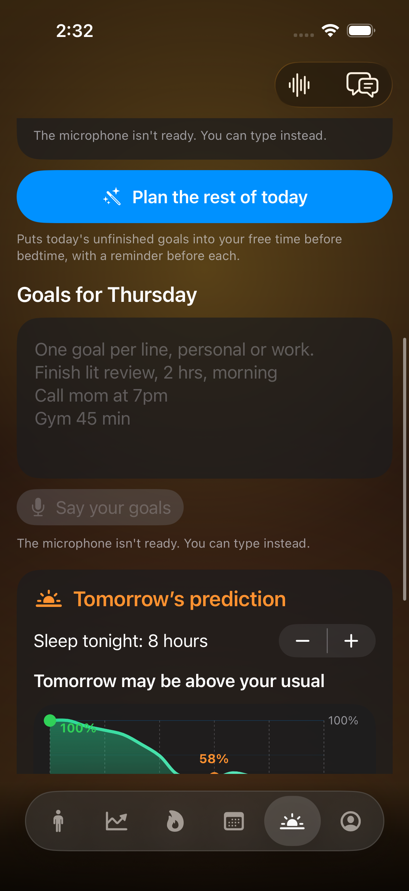
  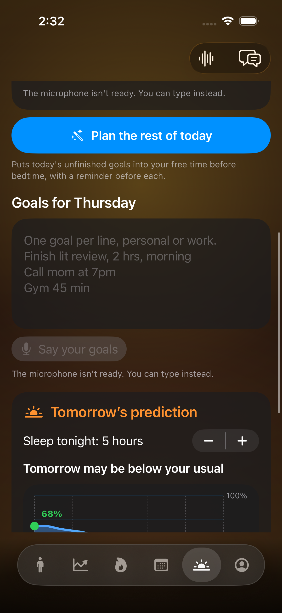
</p>

### 11. Start a conversation, or let Dash speak first

Dash may speak up about a low-energy meeting, a coming dip, an upcoming suggestion, a step
walk, prolonged sitting or a week recap. He leaves time between check-ins and respects quiet hours.

**Free:** read the one-line card and choose **Tell me more** or **Not now**.

**Pro with Gemini enabled:**

1. Tap **Start conversation** on Dash, or answer an automatic check-in. It uses today's calendar, goals and available forecast. You do not need enough health history for a forecast to start manually.
2. After Dash finishes speaking, the app waits briefly to avoid echo, then opens the mic automatically.
3. Answer aloud; about **three seconds of silence** sends the reply. Tap **Send voice message**
   (or Dash) to send sooner. The recognised words appear on the card.
4. Or tap **Type your answer** and Send. Typing stops voice input so the app does not send both at once.
5. Dash remembers the conversation, coaches briefly and asks a follow-up question.
6. Tap **End**, say “thanks, that's all,” or remain silent for about **30 seconds** to finish.
   Typing mode has no silence countdown.

If your personal account appears locked, check **You → myTwin Pro** or restore purchases from the paywall. The demo switch does not grant a personal subscription. After a verified purchase or restore, Pro access updates before the purchase screen closes.

The mentor uses **Gemini-generated voice**, with no local-voice fallback. It requires Pro,
your permission, internet access and a Gemini key. A microphone problem still allows typed replies.
Switching apps, leaving the screen or turning off access ends the conversation.

<p align="center">
  
</p>

### 12. Regular chat, calendar proposals and repeated questions

Tap the chat button and type, or use the voice control. Outside the mentor, say **“twin”**
for hands-free input or tap Dash to start/finish dictation. Regular hands-free sending uses
a longer pause than the mentor. Speech recognition runs on-device.

Try: “What do I have tomorrow?”, “Which goals are left?”, or “How did my week go?” Regular
chat uses Apple Foundation Models when available; Pro can use Gemini with consent and
internet. Dash can use today's and this week's calendar, your health summary, today's plan, week recap,
and today's and tomorrow's goals and streaks to answer you.

To add, move or remove **today's** calendar events, ask Dash, review the proposal and tap
**Confirm**. **Cancel** discards it. A generated reply alone does not save an event.

**You often ask** collects repeated questions over the last two weeks and provides starters
for new users. Pro shows saved answers and can ask again; Free asks you to upgrade.
Demo questions do not enter your personal question history.

### 13. Preferences, voices and quiet hours

Open **You → Make it yours**:

| Setting | What to do |
|---|---|
| Preferred activity / usual time / equipment | Choose activities and durations that fit you. |
| Bedtime | Set your usual bedtime; planning uses it for coffee/wind-down timing. |
| Step / active-energy / weight targets | Enable only the optional targets you want and enter values. |
| Sleep goal | Adjust the hours; this also seeds tomorrow's expected sleep. |
| Add walks when I'm behind | Allow the app to add walks to your calendar when you are behind your step goal. |
| Morning / event / wind-down reminders | Choose which reminder types you want. |
| Bedtime in my calendar | Add/update an app-managed bedtime event; switch off to remove it. |
| Quiet hours | Choose start/end; equal times disable quiet hours. |

Tap **Save**, or **Cancel** to discard preference edits. You choose these targets yourself;
they are not medical recommendations. Calendar reminders and goals also require notification access.

Open **You → Dash's voice** to select an available iPhone voice or a Pro Gemini voice.
iPhone previews use system speech; Gemini's selected voice is used in Gemini sessions.
Enhanced device voices depend on voices downloaded in iOS.

<p align="center">
  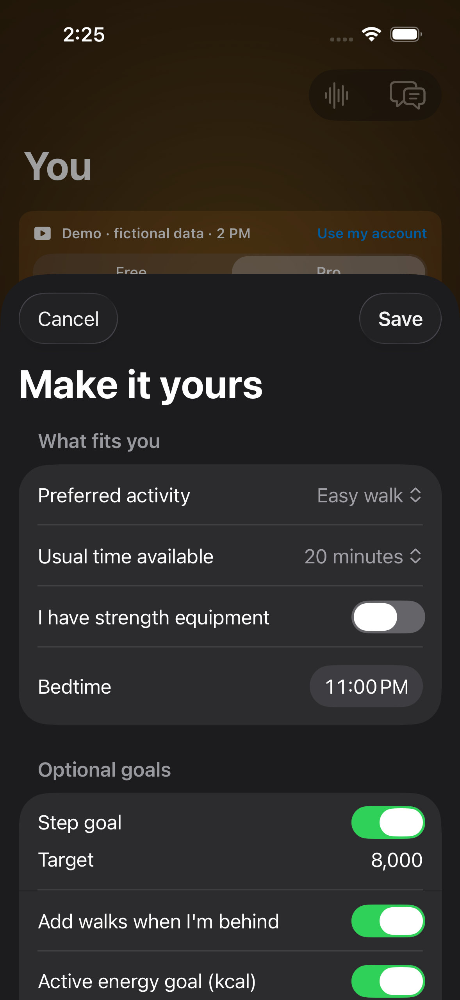
  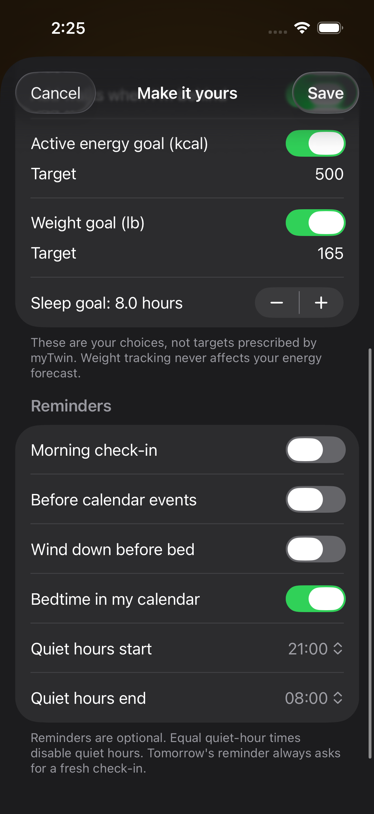
  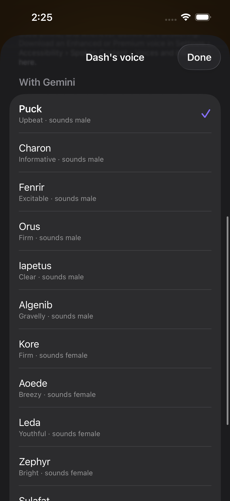
</p>

### 14. Home Screen widget, Live Activity and background updates

Add the **myTwin widget** from the Home Screen's widget picker; small and medium sizes show
the day's estimate and advice, shared through the App Group.

**Up next** can appear on the **Lock Screen** and **Dynamic Island** for the next event or
goal. Open the app with an upcoming item and allow Live Activities in iOS. Pro can include
the forecast. The Live Activity updates when the app updates its next item; there is no
push server continuously advancing it while the app stays closed.

HealthKit background delivery can refresh the estimate and step check when sources sync.
Notifications include morning check-ins, event reminders, wind-down, step walks and goal
reminders. iOS controls delivery and background execution; updates and reminders may arrive later than expected.

<p align="center">
  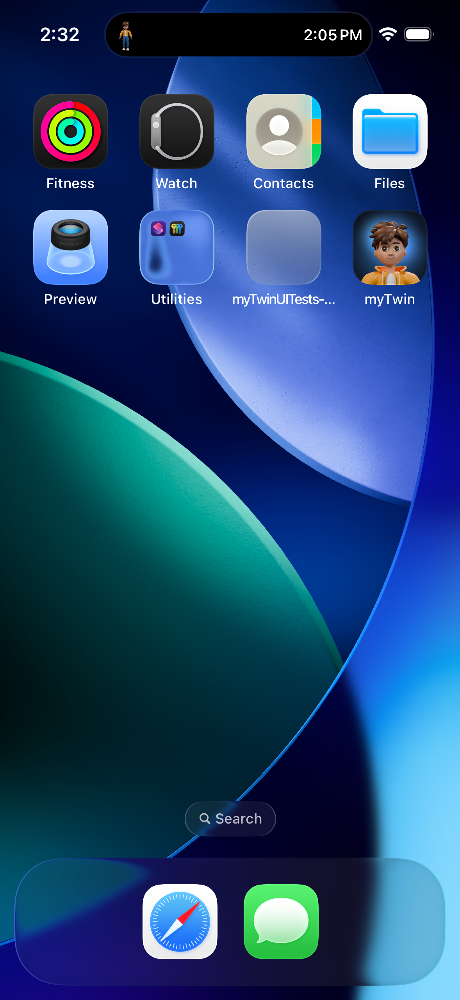
  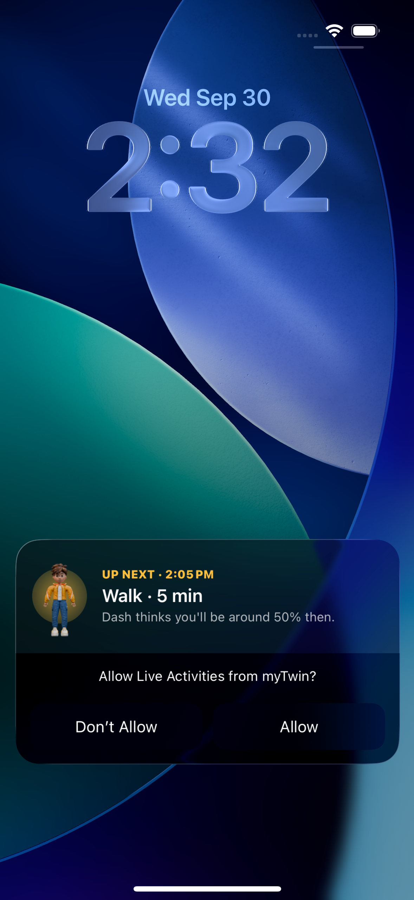
</p>

## Free versus Pro

| Feature | Free | Pro |
|---|:---:|:---:|
| Dash, daily estimate, check-ins, week recap, explanations | ✓ | ✓ |
| Activity metrics, optional targets, weight logging | ✓ | ✓ |
| Day/week calendar, widget, reminders, Up next | ✓ | ✓ |
| Step pace and opt-in automatic walks; bedtime event | ✓ | ✓ |
| Write/edit/complete/carry goals; streaks and celebrations | ✓ | ✓ |
| On-device chat, when Apple Intelligence is available | ✓ | ✓ |
| Hourly forecast and tomorrow sleep what-if | Locked | ✓ |
| Energy-aware suggestions and Rescue my day | Locked | ✓ |
| Plan remaining goals today / plan tomorrow | Locked | ✓ |
| Answers and shortcuts on You often ask | Locked | ✓ |
| Gemini answers and Gemini voice | Locked | With permission, a key and internet |
| Proactive mentor with voice and typed replies | One-line card | With Gemini |

In personal mode, choose **You → Get myTwin Pro** or tap a locked feature. Select an available
plan on the paywall. An existing subscriber can use **myTwin Pro → Manage or restore your plan**
and the restore controls. Prices and available packages come from RevenueCat; read the
current paywall rather than relying on a hard-coded price in this README.

The shipped configuration uses **RevenueCat Test Store**: its purchases are simulated.
The Debug-only **Reset to free** control creates a fresh anonymous RevenueCat test user;
it is not cancellation of an App Store subscription. The demo's Free/Pro switch affects
only the demo.

<p align="center">
  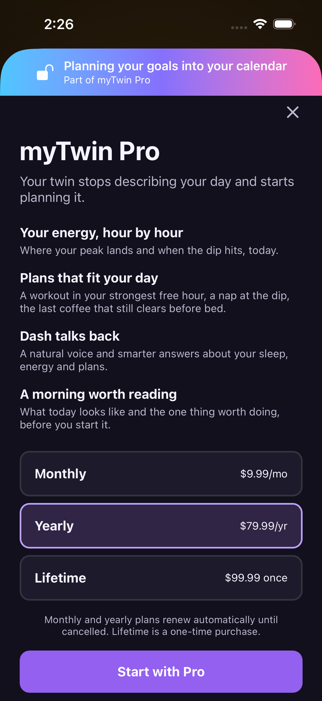
</p>


<details>
<summary>More screenshots: both tiers, goals, settings and voice selection</summary>

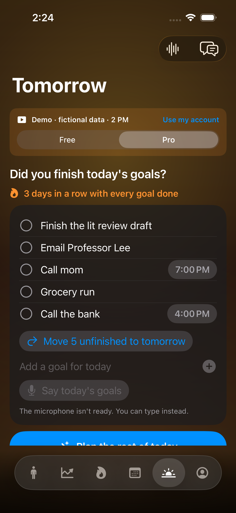
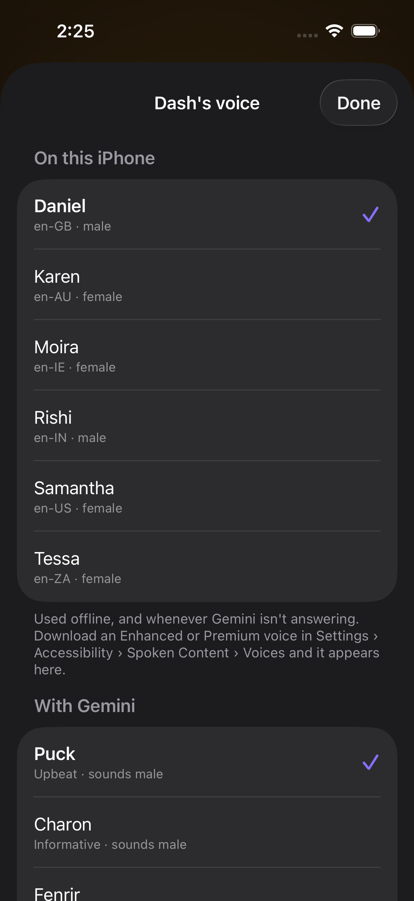
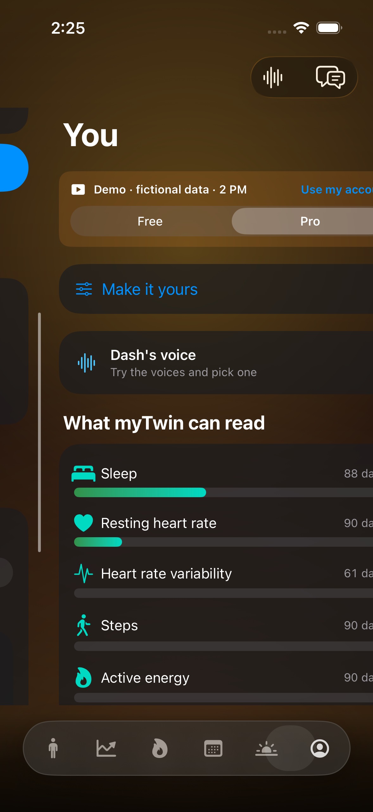
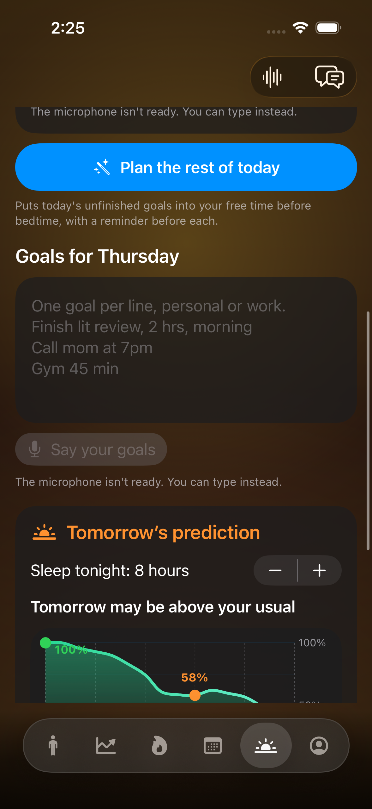
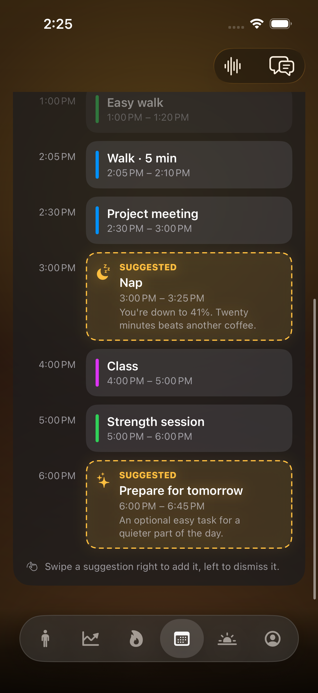
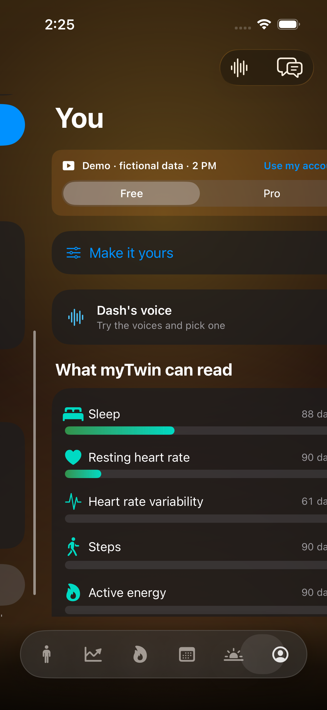
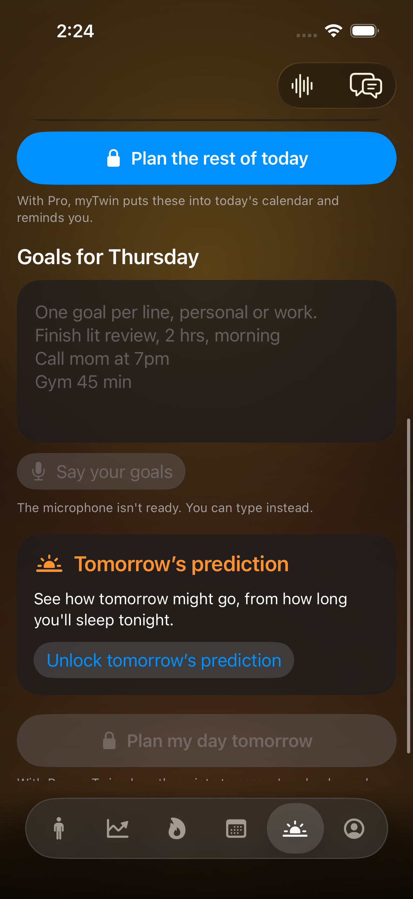
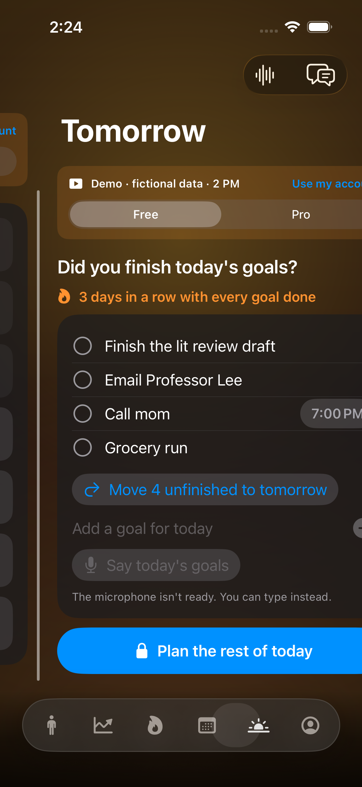
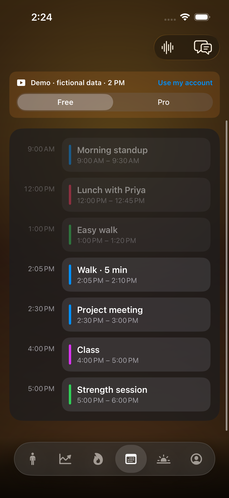
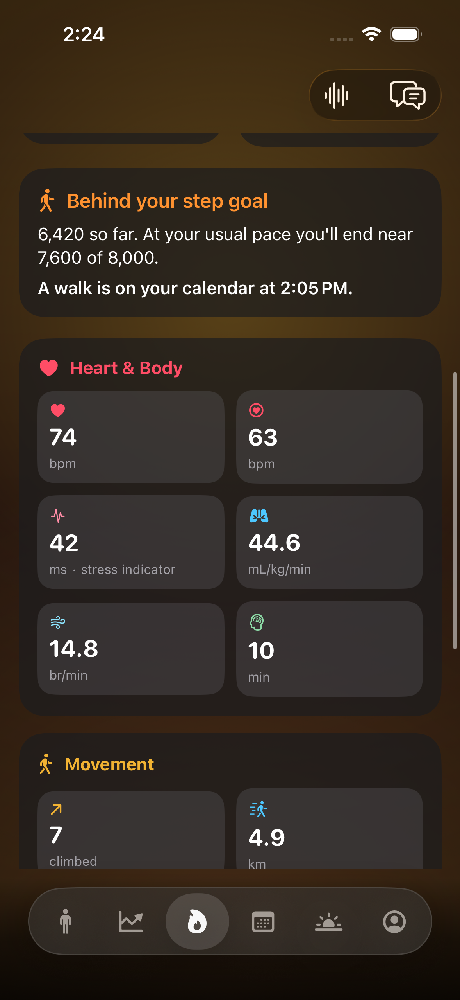
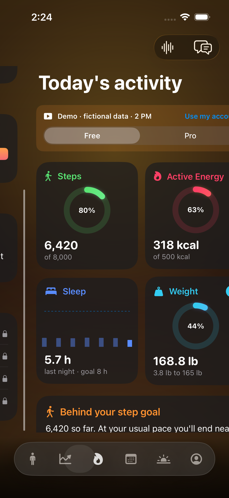
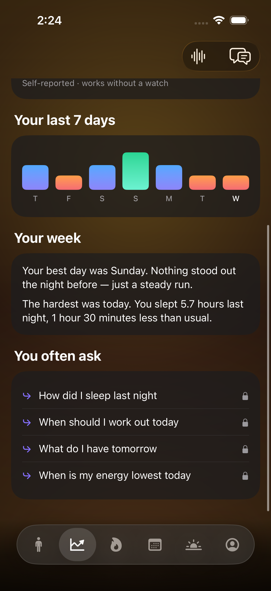

</details>

## Configure integrations

### Apple Health and Calendar

Use the onboarding Connect buttons or **You**. Review app permissions in iOS Settings/Health
if access was denied. Your watch or third-party app must first write records into Apple
Health. Not every source provides every metric, and device syncing can be delayed.

Calendar read/write access is needed for actual scheduling. A user without connected data
can still check in, manage goal text and explore the guest demo. Do not mistake the fictional
demo's filled charts for evidence that personal data has connected.

### Gemini: required for the Pro mentor

1. Get a Gemini API key from [Google AI Studio](https://aistudio.google.com/apikey).
2. From the repository root:

   ```sh
   cp Config/Secrets.xcconfig.example Config/Secrets.xcconfig
   ```

3. Replace `your-key-here` in `Secrets.xcconfig` with your key, without quotes. Do not paste
   the key into Swift, the README or screenshots. This file is git-ignored.
4. Rebuild: `Base.xcconfig` includes the optional secret and the app reads `GeminiAPIKey`
   from its built Info.plist. Changing this file does not update an app already installed on your phone.
5. Use Pro or the Pro demo, stay online, and allow Gemini when asked. Personal mode also has
   **You → Change Gemini permission**.
6. Choose a Gemini voice under **Dash's voice**, then test typed input first.

The client uses `gemini-3.8-live` over the Gemini Live WebSocket API. Your device turns your speech
into text. Gemini sends back spoken audio and the text of its reply. A conversation waits
for the server's completed turn and local playback before automatic listening resumes.
Model availability, quota and billing depend on your Google project. See Google's
[Live API guide](https://ai.google.dev/gemini-api/docs/live-api/capabilities).

Without a working key, your permission or internet, the visual demo still works and regular chat can
use Apple's model where available. **The Pro mentor has no local-model/voice fallback.**
The development key is embedded in the installed client; a public production release needs
a secure way to handle keys. A key included in the app is not protected.

### RevenueCat: existing demo or your own project

For the hackathon demo, keep the existing public SDK key in `Config/Base.xcconfig`. To use
your own RevenueCat project:

1. Create the app/Test Store in RevenueCat.
2. Create products and attach them to entitlement **`mytwin_pro`** (the exact identifier the app checks).
3. Add products/packages to an offering and mark the offering current.
4. Configure/publish a paywall if using the dashboard-designed paywall; the app has a SwiftUI fallback.
5. Set `REVENUECAT_API_KEY` to your app's **public SDK key**, rebuild and test purchase/restore.
6. Before distribution, configure the real App Store products and credentials, production
   SDK key, entitlements, working privacy/terms links and signing. Validate the complete flow.

Reference: [RevenueCat SDK configuration](https://www.revenuecat.com/docs/getting-started/configuring-sdk)
and [products, entitlements and offerings](https://www.revenuecat.com/docs/projects/configuring-products).
Never embed a RevenueCat secret REST API key in the app.

### Widget and device configuration

Both app and extension must use the same App Group, matching `Shared/TwinState.swift`.
Verify the app's HealthKit entitlement, microphone/speech/calendar/Health usage descriptions,
Live Activity support and the extension's bundle/signing settings. No custom backend or
push-notification server is implemented for the Live Activity.

## Privacy and calendar writes

| Path | What happens |
|---|---|
| Local model / speech | Supported Apple on-device services process answers/transcription. |
| Gemini allowed + Pro online | Google can receive your questions and the records Dash needs to answer: calendar, goals, health summary, forecast and week recap. It is **not questions only**. |
| Guest demo | Fictional health/calendar/goals; no real Health/calendar writes from demo actions. |
| Local profile/preferences/goals/history | Stored locally; not an app-managed cloud account. |
| RevenueCat | Handles subscription state with the SDK's app user identity. |
| Chat/mentor calendar proposal | Saved only by **Confirm**; Cancel discards. |
| Rescue | Preview, then explicit confirmation; undo is available. |
| Goal planning/time edits | Pressing the planning button or Save writes the selected changes. |
| Automatic walks / bedtime | Turning on these settings lets myTwin add or update these calendar events. |

Turn Gemini off in **You** to stop future Gemini use. Turning off permission ends the current
conversation with Dash. The app is a planning/wellness prototype, not a medical device.

## Troubleshooting

| What you see | Check next |
|---|---|
| Still learning / no forecast | Today's sleep and seven usable recent nights; Health access and source syncing. Use check-ins/demo meanwhile. |
| Empty activity tiles or fewer metrics | Does Apple Health contain that metric? Missing values are hidden; a connected source may not export it. |
| Mentor doesn't start | Tap Start conversation on Dash. Check Pro, Gemini key, Allow and internet. Automatic check-ins also depend on quiet hours/nudge spacing; manual conversations do not require a forecast. |
| Gemini unavailable | Key/model access, internet, quota and Google project configuration. Rebuild after changing the key. |
| No microphone / on-device dictation unavailable | Test a real supported iPhone, permit microphone/speech, check language/model readiness; type instead. |
| Apple chat unavailable | Apple Intelligence device/model availability; use configured Pro Gemini or the visual demo. |
| Nothing changed on the calendar | Confirm a chat proposal or rescue; grant Calendar access. Demo changes stay in the demo. |
| No purchase packages | Network, current RevenueCat offering, products and exact entitlement `mytwin_pro`. |
| No reminders / Live Activity | iOS permission settings, quiet hours and upcoming items. Reopen to refresh; background timing is system-controlled. |
| Widget stale or empty | Matching App Group/signing, current personal prediction and iOS widget refresh timing. |
| Stuck in the guest demo | Tap Use my account and remove `--sample-day` / `--demo-free` launch arguments. |
| Goal speech splits poorly | Review/edit text before planning; spoken goal splitting needs supported on-device services. |

## Testing and screenshots

The mentor passed **90 code tests (unit tests) and two Simulator app tests (UI tests)** on
30 September 2026. Five Gemini conversations using fictional data completed with several replies and audio.
Five more calendar proposals passed checks of the final confirmation wording. These results
cover the checks we ran; they do not mean every feature has been tested on every device.

```sh
# Pick an installed simulator first.
xcrun simctl list devices available
xcodebuild test -project myTwin.xcodeproj -scheme myTwin   -destination 'platform=iOS Simulator,name=YOUR_INSTALLED_IPHONE'   -only-testing:myTwinTests

# Opt-in live Gemini test: uses fictional demo data and your configured API key.
TEST_RUNNER_MYTWIN_LIVE_TESTS=1 xcodebuild test   -project myTwin.xcodeproj -scheme myTwin   -destination 'platform=iOS Simulator,name=YOUR_INSTALLED_IPHONE'   -only-testing:myTwinUITests/MentorLiveUITests

# Opt-in README screenshots: saved as retained XCTest attachments.
TEST_RUNNER_MYTWIN_README_SHOTS=1 xcodebuild test   -project myTwin.xcodeproj -scheme myTwin   -destination 'platform=iOS Simulator,name=YOUR_INSTALLED_IPHONE'   -only-testing:myTwinUITests/ReadmeScreenshotTests   -only-testing:myTwinUITests/ReadmeDetailScreenshotTests   -only-testing:myTwinUITests/ReadmeForecastScreenshotTests   -only-testing:myTwinUITests/ReadmeLiveActivityScreenshotTests
```

While capturing screenshots, nine main app walkthroughs, five detailed/live walkthroughs
and a personal Pro test using Test Store also passed. After the personal-mode fixes, all 90 unit
tests passed again. To repeat the personal Pro check against the configured Test Store:

```sh
TEST_RUNNER_MYTWIN_TEST_STORE=1 xcodebuild test \
  -project myTwin.xcodeproj -scheme myTwin \
  -destination 'platform=iOS Simulator,name=YOUR_INSTALLED_IPHONE' \
  -only-testing:myTwinUITests/PersonalProUITests
```

This test only accepts RevenueCat's purchase screen when it clearly says the purchase is simulated.

Fresh screenshots in `assets/screenshots/guide/` come from the app, not mockups. See the
[screenshot notes](assets/screenshots/guide/README.md) for modes and dates. Personal-mode
images are explicitly labelled clean sample-profile captures; no private phone records
are presented as demo data. Original Dash renders/animations and earlier screenshots remain
in the repository.

We still need to check the microphone, echo, Bluetooth, three-second reply timing, Health
sync, background updates and notification timing on a real phone. See
[verification notes](docs/verification.md) and [ML documentation](ml/README.md).

## Meet Dash

Dash is a completely original 3D character, modelled, rigged and animated in **Blender** and
running live in **RealityKit**. He isn't a static mascot. His posture, breathing, face and
glow come from your real energy estimate, so you can read your day from across the room.

- 🎨 Hand-built in Blender: sculpted hair, a cloth jacket, and a baked normal map for skin, hair and fabric
- 😀 **16 face blend shapes**: eyes, brows and mouth all move
- 🎬 **9 animation clips** on one timeline, exported as a single USDZ
- 🔆 Real-time lighting: his room and platform glow in the colour of your battery
- 👆 Drag to spin him; tap him to talk

### Four energy states

Rendered in Blender:

<p align="center"></p>

The same four states, live in the app, each with its own glow:

<p align="center"></p>

| State | Charge | What you see |
|---|---|---|
| 🟢 **Energetic** | 80–100% | Stands tall, bouncy breathing, bright eyes. Breaks into a wave or a jump on his own. |
| 🔵 **Normal** | 55–79% | Relaxed and easy. Stretches now and then. |
| 🟠 **Tired** | 30–54% | Shoulders drop, breathing slows, and the yawns start. |
| 🔴 **Exhausted** | 0–29% | Barely upright, eyes heavy. Dozes off mid-idle. |

### Dash in motion

Recorded live in the app. On top of each idle loop, Dash plays gestures that suit his
mood: he waves and jumps when he's energetic, yawns when he's tired, and nods off when he's
exhausted. He also waves to get your attention when he has something to tell you.

<table>
<tr>
<td align="center"><br/><b>👋 Greeting</b><br/><sub>Energetic · says hello when he speaks up</sub></td>
<td align="center">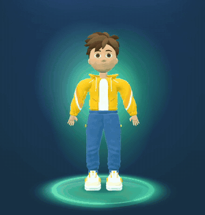<br/><b>⚡ Jump</b><br/><sub>Energetic · rested and charged</sub></td>
<td align="center">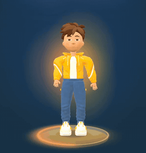<br/><b>🥱 Yawn</b><br/><sub>Tired · running low</sub></td>
<td align="center">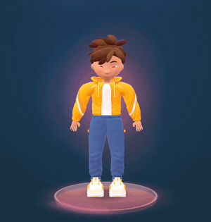<br/><b>😴 Doze</b><br/><sub>Exhausted · nodding off</sub></td>
</tr>
</table>

### Character sheets

<table>
<tr>
<td align="center"><br/><sub>Hero pose</sub></td>
<td align="center"><br/><sub>Three-quarter</sub></td>
<td align="center"><br/><sub>Side</sub></td>
</tr>
<tr>
<td align="center"><br/><sub>Front</sub></td>
<td align="center"><br/><sub>Back: jacket detail</sub></td>
<td align="center"><br/><sub>Face: 16 blend shapes</sub></td>
</tr>
</table>

---

## Honest limits

The model aims to predict **whether energy goes up or down, rather than an exact score**.
We tested it on each person using a model trained on the other people (leave-one-person-out
evaluation), using [PMData](https://datasets.simula.no/pmdata/) (16 people, 1,747 labelled days):

| Target | Mean within-person correlation | People improved | Wilcoxon p |
|---|---|---|---|
| Fatigue | -0.054 → +0.103 | 12/16 | 0.0034 |
| Readiness | +0.051 → +0.124 | 14/16 | 0.0021 |

The average error in readiness scores (MAE) is 1.152 for the baseline and 1.155 for the
model. The model does not improve the accuracy of exact scores. That's why the app shows the percentage and hourly curve as **illustrations**, not
measurements of a body battery, and says so on screen.

A second dataset, LifeSnaps (71 people), gave no usable signal: within a person, tiredness
tracked the hour of the day and nothing else. That negative result, and why a five-weight
ridge regression beat LightGBM, is written up in [`ml/README.md`](ml/README.md).


## Project layout

| Path | Purpose |
|---|---|
| `myTwin/ContentView.swift` | Six tabs, demo/Pro gates and integration of planning/voice |
| `myTwin/MentorConversation.swift` | Mentor turn lifecycle, speech/text answers and ending |
| `myTwin/ChatManager.swift`, `VoiceManager.swift` | Model tools, chat and local speech recognition/playback |
| `myTwin/Gemini/` | Consent, Live WebSocket protocol, Gemini audio/tools |
| `myTwin/Wellness/` | Check-ins, Rescue, goals, feedback, steps, tomorrow outlook and Live Activity |
| `myTwin/Dashboard/` | Activity, calendar, prediction and conversation cards |
| `myTwin/Avatar/` | RealityKit character, animation, lighting and showcase |
| `myTwin/Pro/` | RevenueCat entitlement, purchase/restore and paywall |
| `myTwinWidget/`, `Shared/` | Widget/Live Activity views, shared model/state |
| `Config/` | Build configuration; ignored private Gemini key |
| `myTwinTests/`, `myTwinUITests/` | Unit, UI, live-network and opt-in capture suites |
| `assets/` | App screenshots, Blender sources, renders and animations |
| `ml/` | Training, evaluation, limitations and negative results |

Training datasets are not bundled; consult `ml/README.md` and the source dataset licences
before downloading or reusing them.

## Licence

MIT. See [LICENSE](LICENSE).
