<div align="center">

# myTwin

### Your energy, predicted from your own sleep, and a 3D twin who plans your day around it.


Built for the [RevenueCat Shipaton 2026](https://www.shipaton.com) · Next Gen Award

</div>

---

Every health app tells you how you slept. Almost none tell you **what to do about it today**.

**myTwin** reads your sleep and heart rate from Apple Health, works out whether today will run
above or below *your own* normal, and shows it through **Dash**: a fully animated 3D twin
who stands tall when you're charged and yawns when you're running low. Then it acts on that
reading. It fits a workout into your strongest free hour, puts a nap at the dip, and tells
you when your last coffee still clears before bed. When the day falls apart, one tap on
**Rescue my day** rebuilds it around how you actually feel.

<p align="center">
  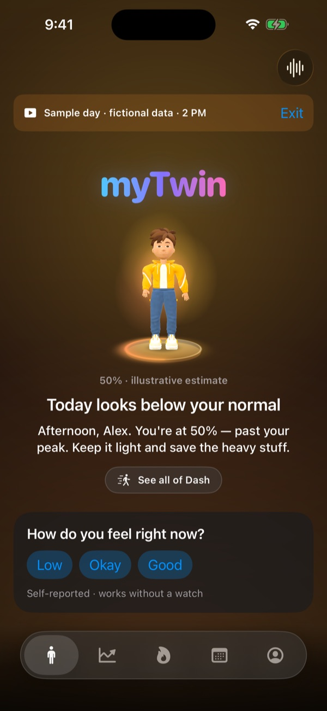
  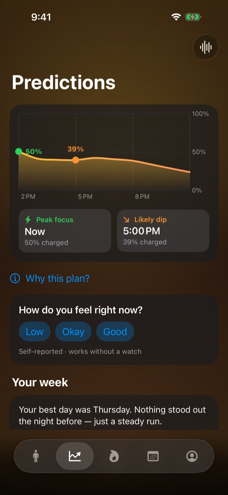
  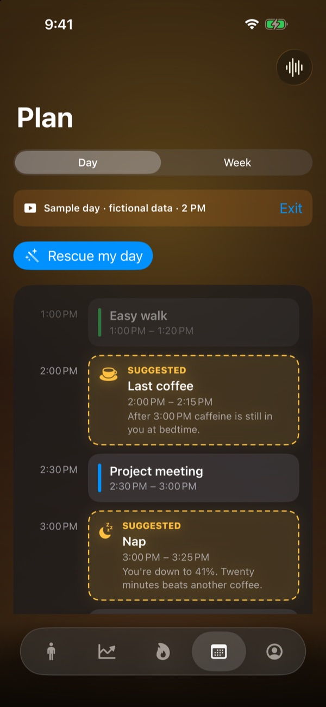
  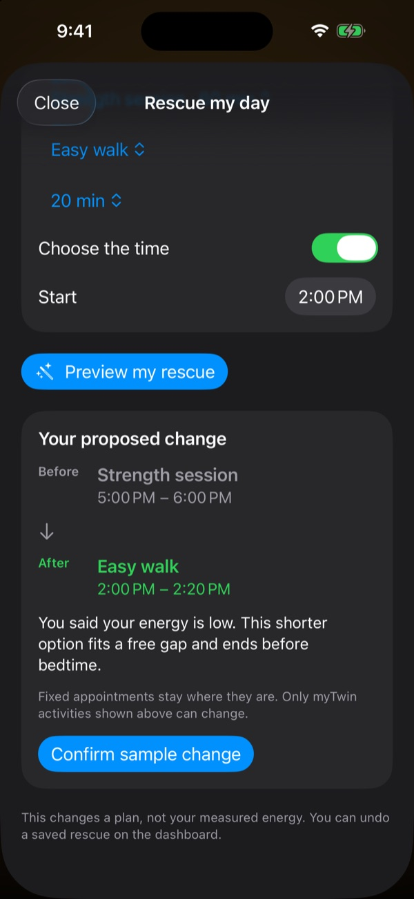
</p>

## Contents

- [Who it's for](#who-its-for)
- [Meet Dash](#meet-dash)
- [Features](#features)
- [Free and Pro, powered by RevenueCat](#free-and-pro-powered-by-revenuecat)
- [How it works](#how-it-works)
- [Try it in 60 seconds](#try-it-in-60-seconds)
- [Honest limits](#honest-limits)
- [Building it](#building-it)

## Who it's for

| | The problem | What myTwin does |
|---|---|---|
| 💼 **The busy professional** | Back-to-back meetings, the 3 PM crash, one coffee too many. | Predicts the dip before it hits, finds the one free gap for a walk or a nap, and warns you before a demanding meeting lands on a low-energy hour. |
| 🏃 **The athlete** | Training hard on a poor night's sleep, or wasting a great one. | Compares last night with *your* baseline, suggests when to push and when to go easy, and swaps a strength session for mobility work when you're drained. |
| 🙂 **Everyone else** | Wearables produce numbers, not decisions. | One glance at Dash says how today will go. One tap fixes the plan. No watch? A three-button check-in works from day one. |

---

## Meet Dash

Dash is a completely original 3D character, modelled, rigged and animated in **Blender** and
running live in **RealityKit**. He isn't a static mascot. His posture, breathing, face and
glow come from your real energy estimate, so you can read your day from across the room.

- 🎨 Hand-built in Blender: sculpted hair, a cloth jacket, and a baked normal map for skin, hair and fabric
- 😀 **16 face blend shapes**: eyes, brows and mouth all move
- 🎬 **9 animation clips** on one timeline, exported as a single USDZ
- 🔆 Real-time lighting: his room and platform glow in the colour of your battery
- 👆 Drag to spin him; tap him to talk

### Four energy states

Rendered in Blender:

<p align="center"></p>

The same four states, live in the app, each with its own glow:

<p align="center">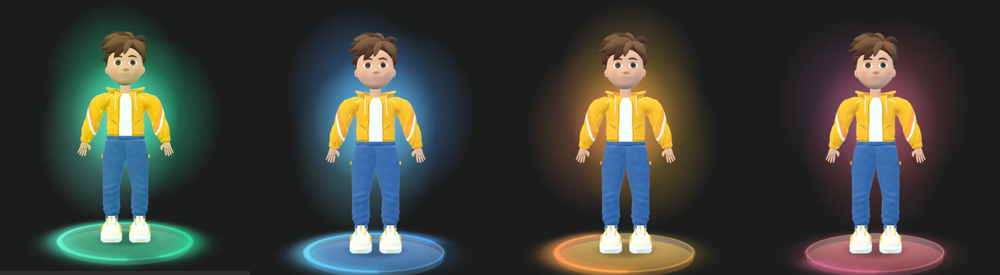</p>

| State | Charge | What you see |
|---|---|---|
| 🟢 **Energetic** | 80–100% | Stands tall, bouncy breathing, bright eyes. Breaks into a wave or a jump on his own. |
| 🔵 **Normal** | 55–79% | Relaxed and easy. Stretches now and then. |
| 🟠 **Tired** | 30–54% | Shoulders drop, breathing slows, and the yawns start. |
| 🔴 **Exhausted** | 0–29% | Barely upright, eyes heavy. Dozes off mid-idle. |

### Gestures

On top of each idle loop, Dash plays one-shot gestures that suit his mood: he waves and
jumps when energetic, stretches when normal, yawns when tired and dozes when exhausted.

<table>
<tr>
<td align="center">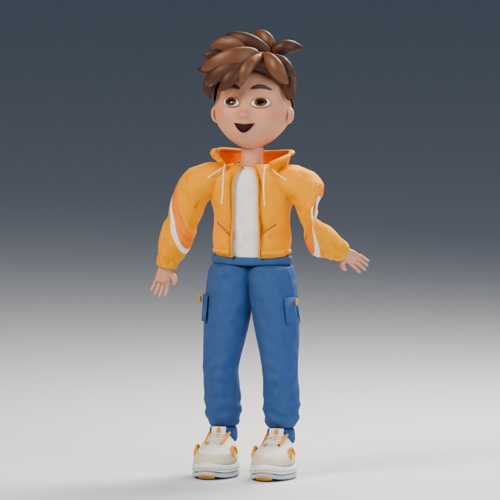<br/><sub><b>Yawn</b>, when he's tired</sub></td>
<td align="center">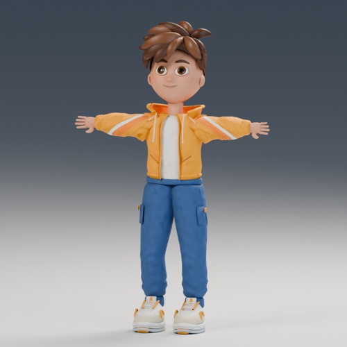<br/><sub><b>Stretch</b>, on a normal day</sub></td>
<td align="center"><br/><sub><b>Celebrate</b>, arms up</sub></td>
<td align="center">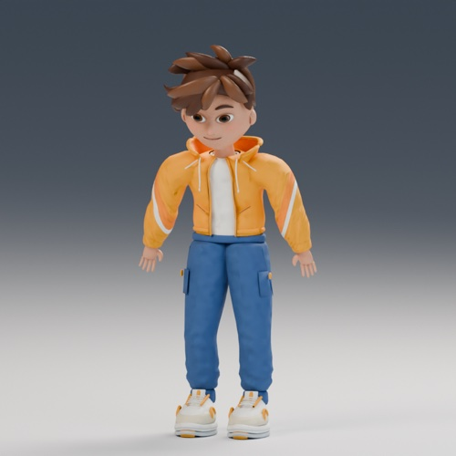<br/><sub><b>Exhausted</b>, head dropping</sub></td>
</tr>
</table>

<sub>Frames rendered in Blender from Dash's source clips.</sub>

### Character sheets

<table>
<tr>
<td align="center"><br/><sub>Hero pose</sub></td>
<td align="center"><br/><sub>Three-quarter</sub></td>
<td align="center"><br/><sub>Side</sub></td>
</tr>
<tr>
<td align="center"><br/><sub>Front</sub></td>
<td align="center"><br/><sub>Back: jacket detail</sub></td>
<td align="center"><br/><sub>Face: 16 blend shapes</sub></td>
</tr>
</table>

---

## Features

### 1. Your twin, at a glance

Open the app and Dash tells you how today will go, compared with **your** normal rather than
someone else's average. There's a charge estimate, a one-line verdict ("Today looks below
your normal"), and a greeting that knows the time of day and what's next on your calendar.

- 💼 **Busy person:** a two-second read on whether today is a push day or a protect-your-energy day.
- 🏃 **Athlete:** see at a glance whether last night's recovery supports hard training.
- 🙂 **Everyone:** no charts to decode. Dash's posture and glow say it before you read a word.

<p align="center"></p>

### 2. One-tap check-in, and Dash gets bigger

**"How do you feel right now?"** takes one tap: *Low*, *Okay* or *Good*. Your answer shapes
today's suggestions straight away and works without any watch. Once you've answered, the card
steps aside and **Dash grows into the space**. He asks again later, once in the afternoon and
once in the evening, because how you felt at 9 AM says little about 9 PM.

- 💼 A check-in that fits between meetings.
- 🏃 Your own reading beats the watch: if you feel flat, the plan softens even when the data says you're fine.
- 🙂 Useful from the very first day, before there's any sleep history.

<p align="center">
  
  &nbsp;&nbsp;➜&nbsp;&nbsp;
  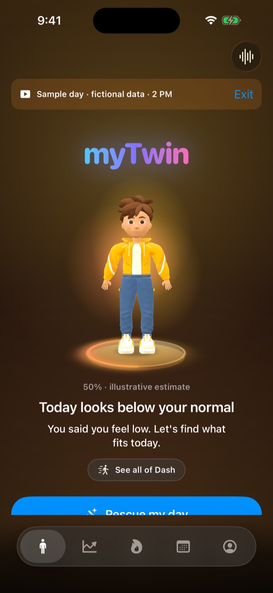
</p>

### 3. Your energy, hour by hour <sup>PRO</sup>

A forecast curve for the rest of the day, marking your **peak focus** window and your
**likely dip** with a time and an estimated charge.

- 💼 Put deep work in the peak and admin in the dip.
- 🏃 Time training for when you're strongest, not just when there's a free slot.
- 🙂 Stop being surprised by the afternoon slump.

<p align="center"></p>

### 4. Your week, told as a story

No chart to squint at. myTwin writes your week in plain sentences: your **best day** and the
night before it, your **hardest day** and what drove it (a short night, a raised resting heart
rate, less deep sleep), and one pattern across the week. Every reason is measured against
your own averages, and when the data shows no reason, it says so instead of inventing one.

- 💼 Understand *why* Tuesday was rough in one sentence.
- 🏃 Spot the link between late nights and flat sessions.
- 🙂 Reflection without spreadsheets.

<p align="center">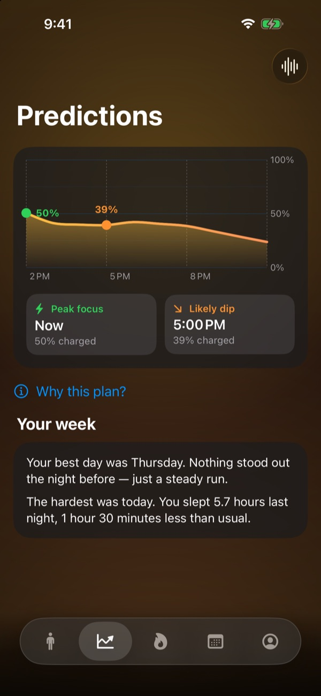</p>

### 5. Why this plan? Complete transparency

Tap **Why this plan?** to see exactly what was measured (last night's sleep, your usual sleep,
how many usable nights), what was *estimated*, and what's missing. Estimates are always
labelled as estimates.

- 💼 **and** 🏃 Trust comes from seeing the inputs, and you can override anything with a check-in.
- 🙂 No black box, and no health claims the data can't support.

<p align="center">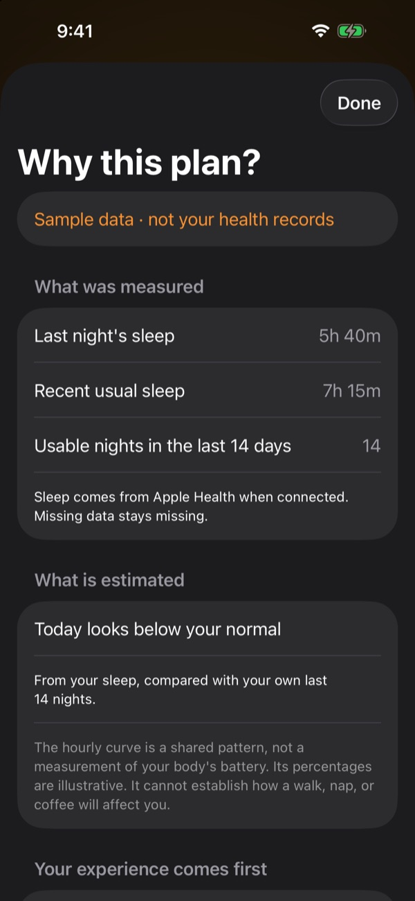</p>

### 6. A plan that fits around your calendar <sup>PRO</sup>

myTwin reads your calendar and walks the free gaps in 15-minute steps. It suggests only what
fits: a **walk**, a **power nap** at the dip, a **last coffee** that still clears before bedtime,
or a **wind-down** before bed. Suggestions you dismiss three times stop coming back.

- 💼 A day planner that respects your meetings instead of fighting them.
- 🏃 Recovery and training slotted into real, available time.
- 🙂 Caffeine timing that protects tonight's sleep.

<p align="center"></p>

### 7. Rescue my day <sup>PRO</sup>

The headline feature. When the day goes wrong, **Rescue my day** rebuilds it:

1. Pick what to change: swap a planned session, or **add a new flexible activity**.
2. Choose the activity and how long you've got.
3. **Choose the time yourself**, or let Dash find the next free gap. If your time is taken, he moves to the next free slot and tells you.
4. **Preview the before and after** with a plain-English reason, then confirm.

Fixed appointments never move. Only activities myTwin created can change, and every rescue
can be **undone** from the dashboard.

- 💼 Slept badly before a packed day? Turn the 5 PM gym session into a 20-minute walk at 2 PM in three taps.
- 🏃 Keep the habit on a low day by scaling the session down instead of skipping it.
- 🙂 It removes the guilt of a broken plan by giving you a smaller one that still counts.

<p align="center">
  
  &nbsp;&nbsp;➜&nbsp;&nbsp;
  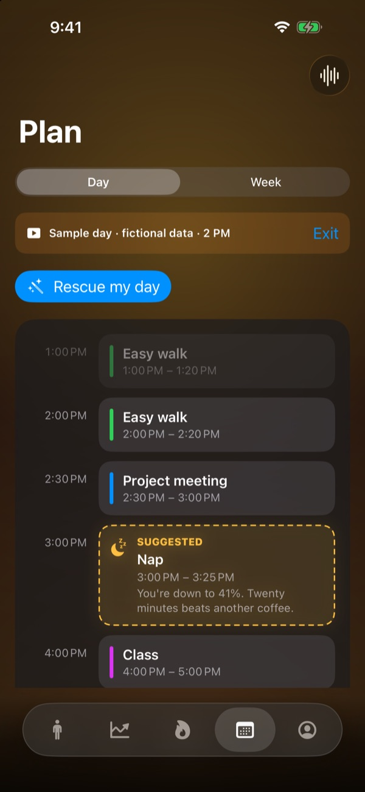
</p>

### 8. Did that help? Feedback that learns

After an activity, myTwin asks one question: did you feel **better**, the **same** or
**worse**? Or did you skip it? Repeated answers adjust what it suggests next: if walks keep
leaving you worse and stretching keeps helping, it suggests stretching. Small samples are
labelled as small samples. The **Undo** card sits right there too.

- 🏃 Find out what actually recovers *you*.
- 🙂 Feedback stays on your iPhone.

<p align="center">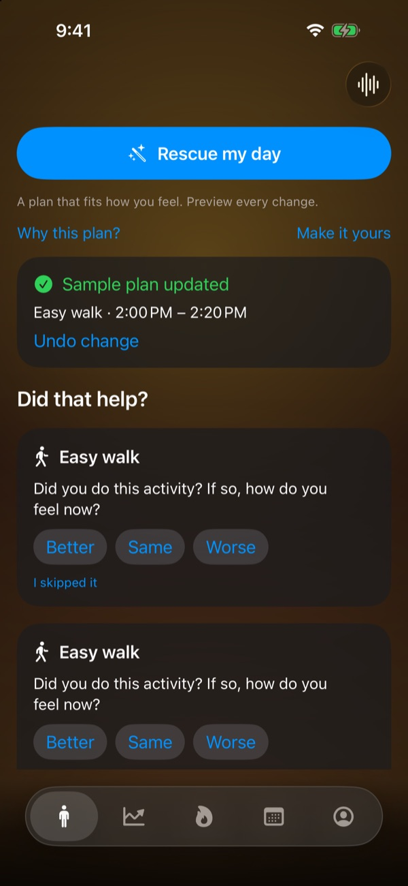</p>

### 9. Make it yours

Set your preferred activity, the time you usually have, whether you own strength equipment,
your bedtime, optional step, active-energy, weight and sleep goals, and reminders. These are
your choices, not targets myTwin prescribes, and weight never affects the energy forecast.

<p align="center">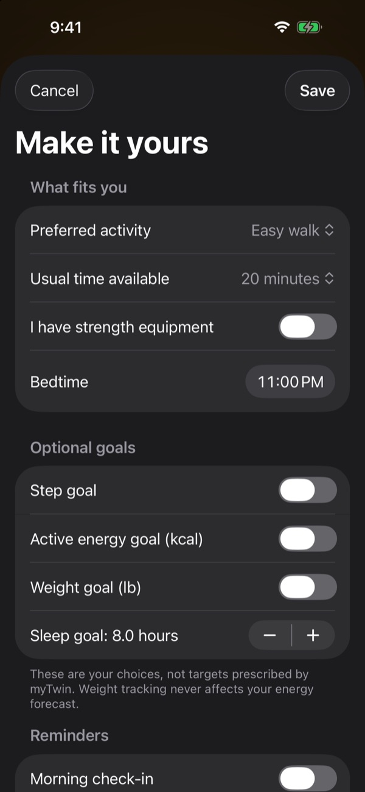</p>

### 10. Dash speaks up first

Dash doesn't wait to be asked. On any page, and each time you come back to the app, he
checks whether something is worth saying, then shows a card and **says it out loud**:

- ☕ "Coming up at 2:00 PM: Last coffee. After 3:00 PM caffeine is still in you at bedtime."
- 📉 A dip coming up with nothing booked before it.
- 📅 A demanding meeting landing on a low-energy hour.
- 🪑 "Barely a step in the last two hours" when you've been sitting.
- 📖 Your week's story on Sunday evening.

Tap **Tell me more** for a full answer. He speaks with the iPhone's own voice, so there's no
microphone, no network and no lag. He also knows when to stay quiet: once a day per topic,
90 minutes between nudges, and never during quiet hours.

<p align="center">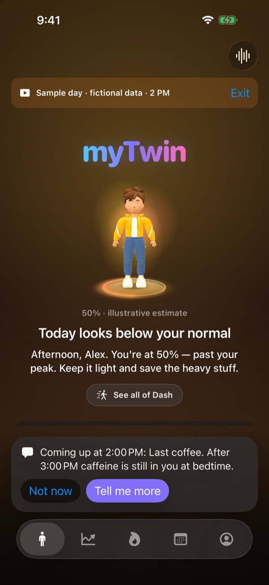</p>

### 11. Talk to Dash

Say **"twin"** or tap Dash, and ask anything: *"How did I sleep?"*, *"When should I work
out?"*, *"What do I have tomorrow?"* He answers from your real data, calendar and plan.

- 🎙️ Wake word with near-miss matching (*tween*, *twain*, *twine*), transcribed on your iPhone
- 🧠 Answers from **Apple Foundation Models** on your iPhone, or **Gemini** with Pro and your explicit consent
- 🗣️ Choose his voice: iPhone voices for offline, or natural **Gemini Live** voices with Pro
- 📅 He can read your calendar and propose changes, which you confirm before anything is saved

<p align="center">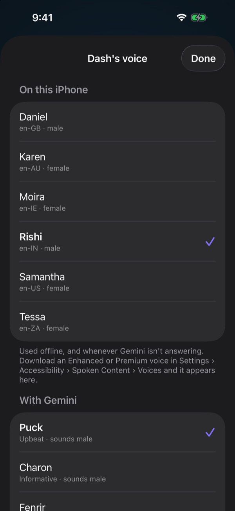</p>

### 12. "You often ask": free vs Pro

myTwin notices the questions you repeat over the last two weeks and turns them into one-tap
shortcuts. New users see three starter questions.

- **Free:** your questions with a lock. Tapping one explains the Pro upgrade.
- **Pro:** Dash's latest answer sits under each question, and a tap asks again for a fresh one.

<p align="center">
  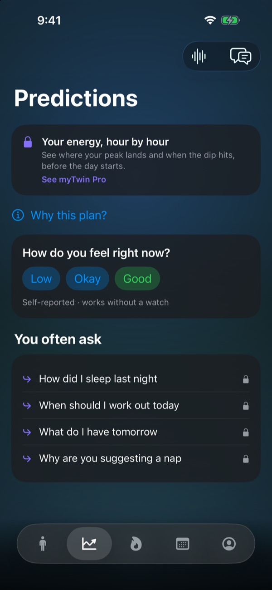
  &nbsp;&nbsp;
  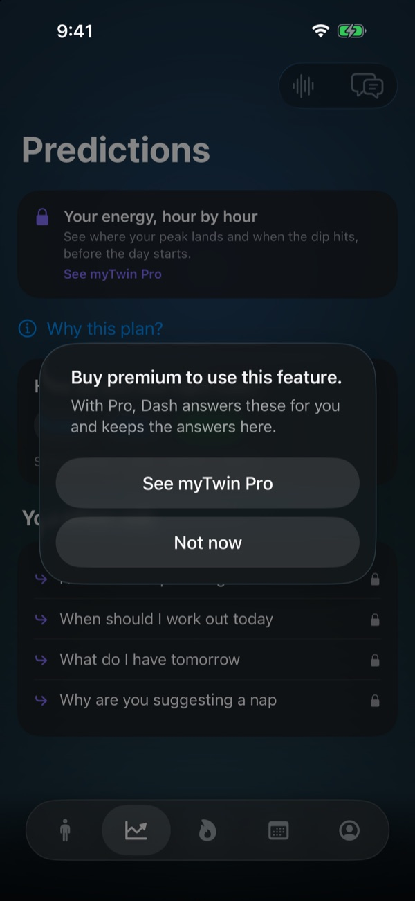
</p>

### 13. Works while the app is closed

- A **HealthKit background observer** wakes myTwin when your watch syncs, recomputes, and refreshes everything.
- A **Home Screen widget** (small and medium) shows today's estimate and one piece of advice.
- **Notifications:** a morning briefing, a heads-up 10 minutes before each event, and a bedtime nudge.

### 14. Your data, your connections

The **You** page holds everything personal: preferences, Dash's voice, your plan, and clear
switches for Apple Health, Calendar and Gemini, each explaining exactly what it's used for.
Health data stays on your iPhone. Google only receives questions if you turn Gemini on.

<p align="center">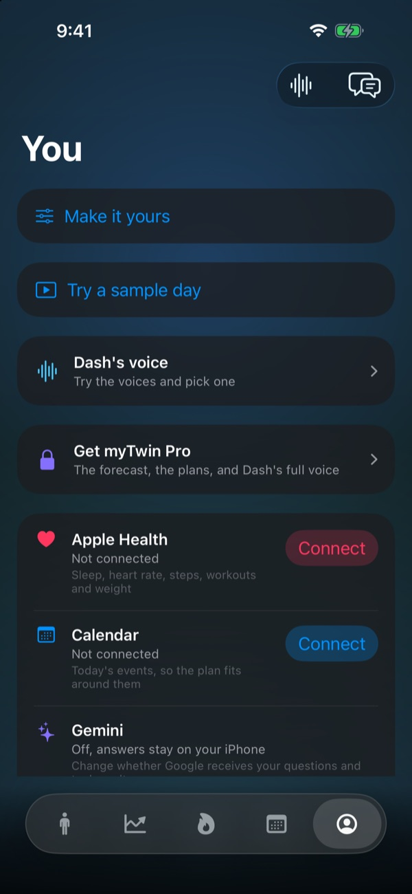</p>

---

## Free and Pro, powered by RevenueCat

| | Free | **myTwin Pro** |
|---|:---:|:---:|
| Dash, charge estimate and today's verdict | ✅ | ✅ |
| One-tap check-in, week story, Why this plan | ✅ | ✅ |
| Your calendar, notifications, widget | ✅ | ✅ |
| On-device chat (Apple Foundation Models) | ✅ | ✅ |
| Energy forecast, hour by hour | 🔒 | ✅ |
| Smart suggestions in your free time | 🔒 | ✅ |
| **Rescue my day** | 🔒 | ✅ |
| Answers on the "You often ask" card | 🔒 | ✅ |
| Gemini answers and natural Gemini voices | 🔒 | ✅ |

Plans: **Monthly $9.99**, **Yearly $79.99**, **Lifetime $99.99**, all configured in the
RevenueCat dashboard.

<p align="center">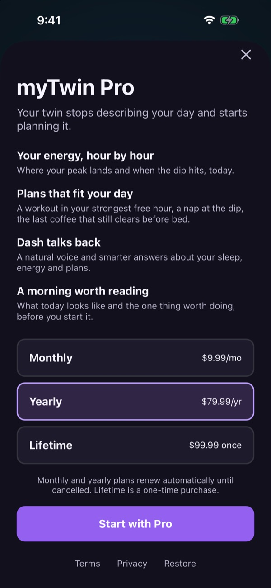</p>

**Integration details**

- `Subscription.swift` wraps the SDK: `configure`, `customerInfo()`, `offerings()`, `purchase(package:)`, `restorePurchases()`, and `customerInfoStream`, so an unlock lands instantly without a restart.
- Everything is gated on one entitlement, `mytwin_pro`. Locked features show a card that opens the paywall in place, and a successful purchase returns you to where you were.
- `ProPaywall` shows the paywall designed in the RevenueCat dashboard (Paywalls V2), with a hand-written SwiftUI fallback.
- **Customer Center** (`RevenueCatUI`) handles managing and restoring a plan.

> This repository uses a RevenueCat **Test Store** key: purchases are simulated and no money
> moves. Switching to an App Store (`appl_…`) key is a one-line change in
> `Config/Base.xcconfig`.

---

## How it works

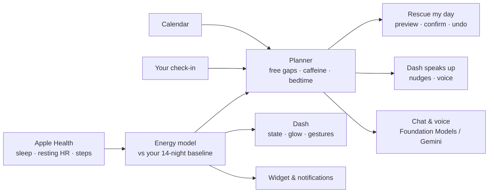

- **Predicts** whether today is better or worse than *your* normal, not an absolute score. Five sleep and resting-heart-rate features, relative to your recent baseline. A prediction needs today's sleep plus seven usable nights in the previous 14 days. Check-ins work immediately.
- **Plans** by walking the gaps between real events in 15-minute steps.
- **Talks** through Apple's on-device `SpeechAnalyzer` for transcription, Foundation Models or Gemini for answers, and tool calls that read your data, calendar, plan and week.
- **Tested:** 35 unit tests (planner, rescue, week story, nudges, questions, daily support) and sample-day UI tests.

## Try it in 60 seconds

No Apple Health or calendar data needed. Everything below uses a fictional day for "Alex".

1. Open **You → Try a sample day** (or the welcome screen's button). A banner marks it as fictional.
2. Watch Dash: he's **Tired** at 50%, and within a few seconds he speaks up about your last coffee.
3. Tap **Low** on the check-in. The card steps aside and Dash grows.
4. Swipe to **Predictions** to see the dip at 5 PM, then read *Your week*.
5. Open **Plan → Rescue my day**, turn on **Choose the time**, preview and confirm. Then undo it from the dashboard.
6. Tap **See all of Dash** to meet every state.
7. Tap **Exit** to return to your own day.

## Honest limits

The model predicts **direction, not a number**. Measured with leave-one-person-out
evaluation on [PMData](https://datasets.simula.no/pmdata/) (16 people, 1,747 labelled days):

| Target | Mean within-person correlation | People improved | Wilcoxon p |
|---|---|---|---|
| Fatigue | -0.054 → +0.103 | 12/16 | 0.0034 |
| Readiness | +0.051 → +0.124 | 14/16 | 0.0021 |

Readiness MAE is 1.152 for the baseline and 1.155 for the model: absolute accuracy does not
improve. That's why the app shows the percentage and hourly curve as **illustrations**, not
measurements of a body battery, and says so on screen.

A second dataset, LifeSnaps (71 people), gave no usable signal: within a person, tiredness
tracked the hour of the day and nothing else. That negative result, and why a five-weight
ridge regression beat LightGBM, is written up in [`ml/README.md`](ml/README.md).

## Building it

Requires Xcode 26 and iOS 26. Dash's 3D scene runs best on a device; everything else runs in
the Simulator.

```bash
git clone https://github.com/aditya-baniya-ai/myTwin.git
open myTwin/myTwin.xcodeproj
```

It builds and runs as-is. The RevenueCat public key is committed (public keys are meant to be),
so the paywall works out of the box.

### Gemini API key (optional)

Without a key, Dash answers on-device with Apple's Foundation Models. To try Gemini:

1. Get a free key at <https://aistudio.google.com/apikey>.
2. `cp Config/Secrets.xcconfig.example Config/Secrets.xcconfig`
3. Replace `your-key-here` in `Config/Secrets.xcconfig` with your key.

`Secrets.xcconfig` is in `.gitignore` and must never be committed.

### Tests

```sh
xcodebuild -project myTwin.xcodeproj -scheme myTwin \
  -destination 'platform=iOS Simulator,name=iPhone 17' test
```

Use any installed simulator. See [`docs/verification.md`](docs/verification.md) for results.

## Project layout

| Path | What's in it |
|---|---|
| `myTwin/` | The app: five pages (Dash, Predictions, Activity, Plan, You) |
| `myTwin/Avatar/` | RealityKit Dash: loading, animation, lighting, showcase |
| `myTwin/Wellness/` | Check-ins, Rescue my day, feedback, preferences |
| `myTwin/Dashboard/` | Cards, smart calendar, forecast chart |
| `myTwin/Gemini/` | Gemini Live client and consent flow |
| `myTwin/Pro/` | RevenueCat subscription wrapper and paywall |
| `myTwinWidget/` | Home Screen widget |
| `Shared/` | Code and the model shared with the widget |
| `assets/Dash/` | Blender files, build scripts, renders |
| `ml/` | Training, evaluation, and what didn't work |

Training data is not in this repository: PMData is CC BY-NC and belongs to its authors.
`ml/download_pmdata.py` fetches it.

## Licence

MIT. See [LICENSE](LICENSE).
