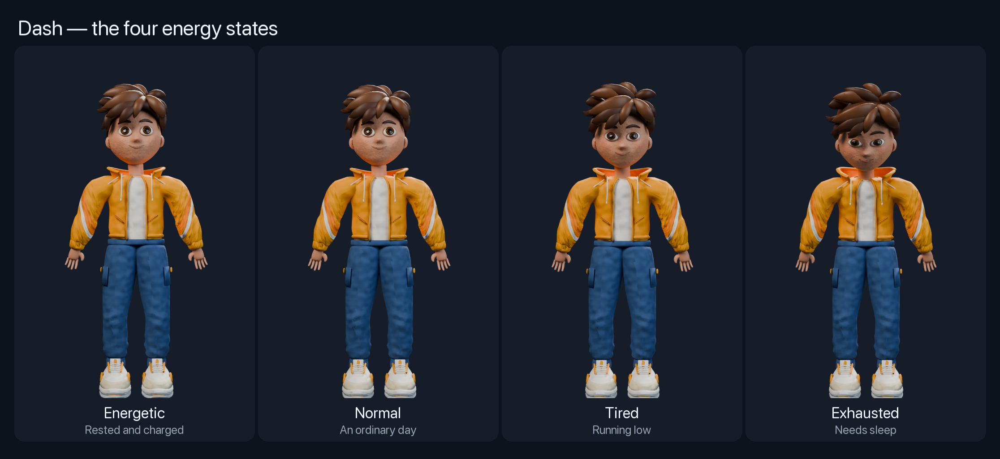
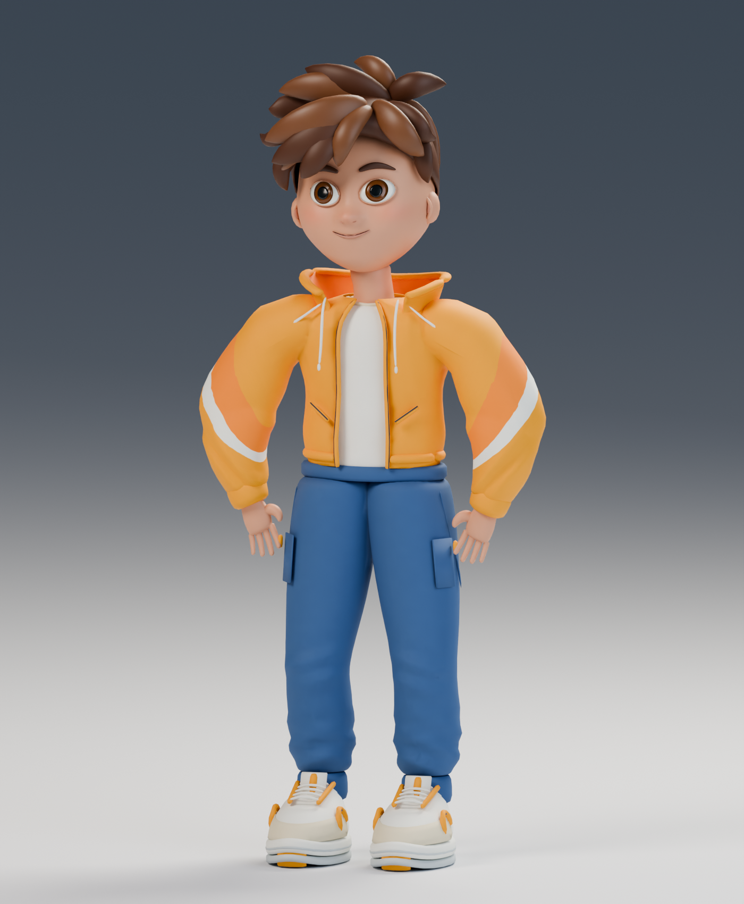
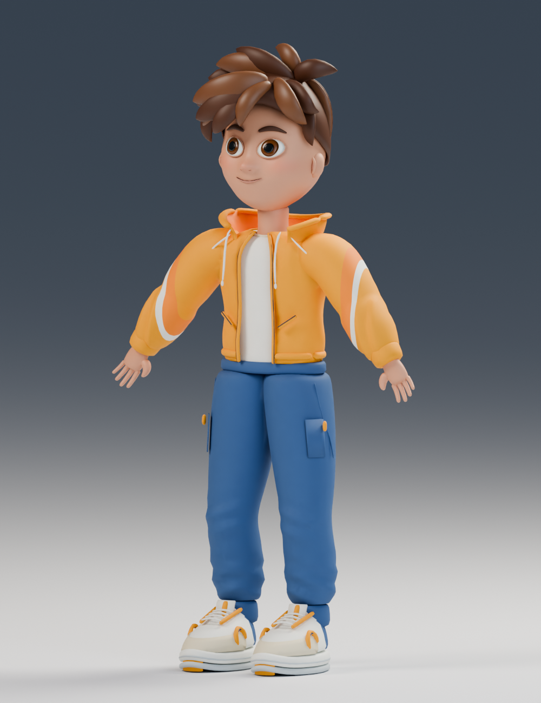
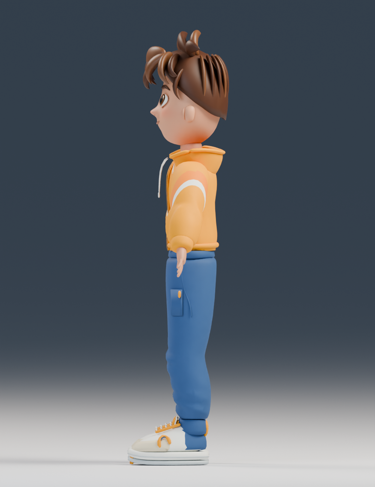
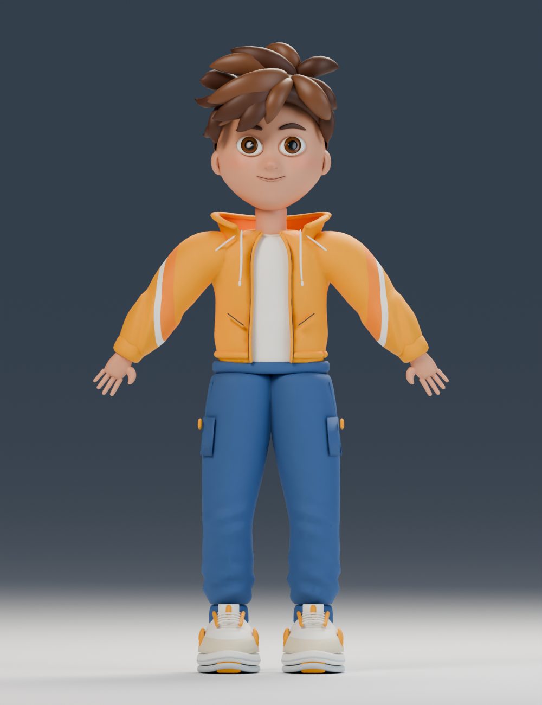
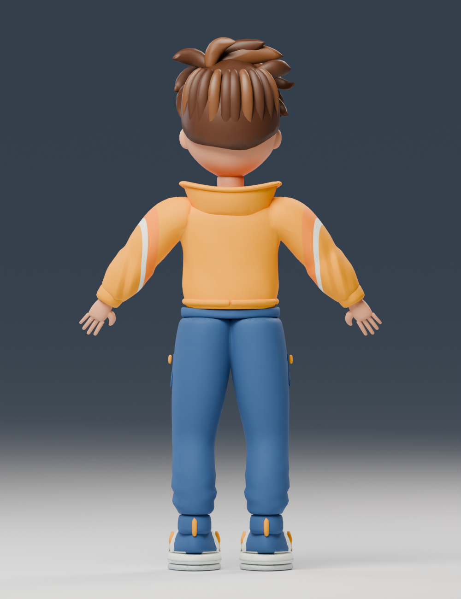
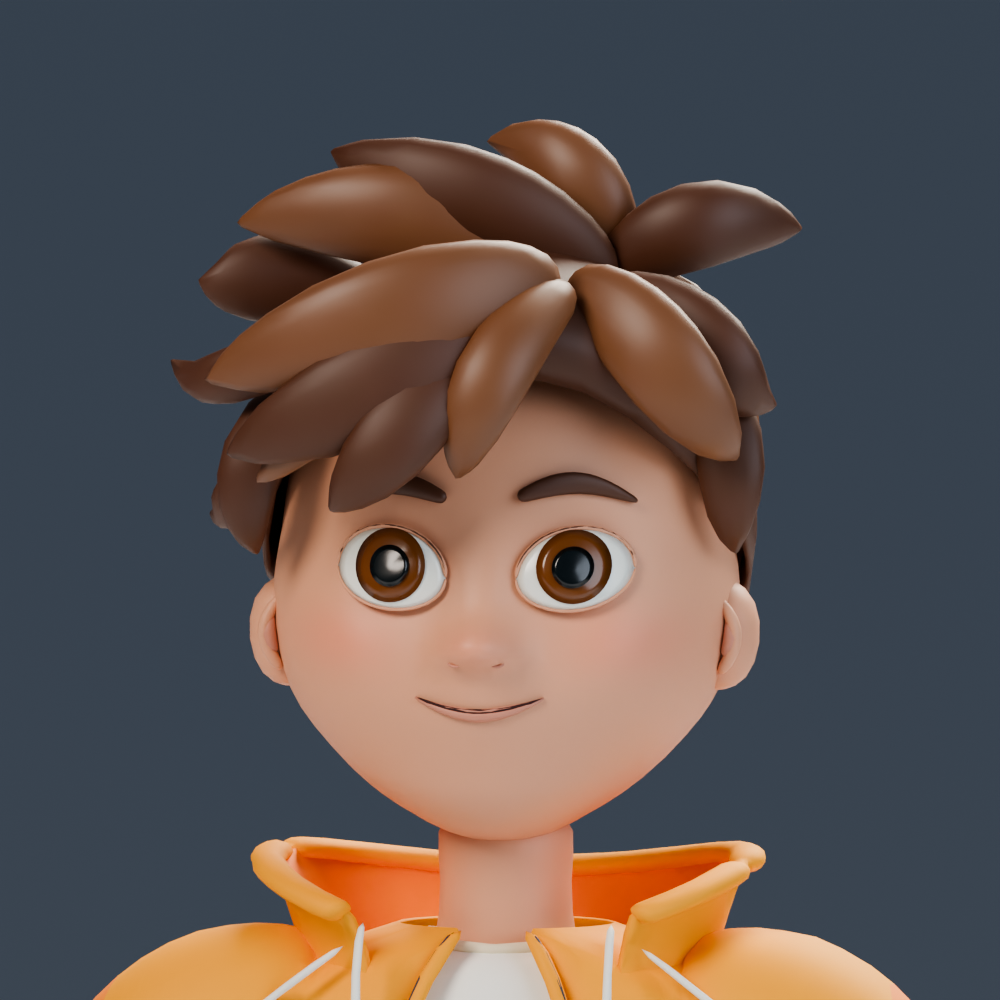

# myTwin

An iOS app with a 3D twin who reads your health data, works out when your energy will
peak and dip today, and puts things in the gaps in your calendar — a workout in your
strongest free hour, a nap at the dip, the last coffee that still clears before bed.

Built for the [RevenueCat Shipaton 2026](https://www.shipaton.com) Next Gen Award.

## What it does

**Reads** sleep, resting heart rate, heart rate variability, steps, active energy,
workouts and weight from Apple Health, plus today's events from your calendar.

## Dash

Dash is a fully custom 3D character — modelled, rigged, and animated in Blender, then
exported as a single USDZ with nine clips on one timeline. He runs live in RealityKit,
lit and animated in real time from your health data.

### The four energy states

Each state is a looping idle animation driven by your charge score (0–100). Dash doesn't
just change colour — his posture, breathing, and face all shift.



| State | Score | What you see |
|---|---|---|
| **Energetic** | 80–100 | Stands tall, bouncy breathing, bright eyes. Breaks into a wave or a jump on his own. |
| **Normal** | 55–79 | Easy, neutral posture. Stretches now and then. |
| **Tired** | 30–54 | Shoulders drop, slower breathing. Yawns periodically. |
| **Exhausted** | 0–29 | Barely upright, eyes heavy. Dozes off mid-idle. |

### One-shot gestures

On top of the idle loop, Dash plays five one-shot clips — triggered automatically based
on his state, or on demand via the "Meet Dash" showcase screen:

| Gesture | Triggered when |
|---|---|
| **Wave** | Energetic state, randomly |
| **Jump** | Energetic state, randomly |
| **Stretch** | Normal state, randomly |
| **Yawn** | Tired state, randomly |
| **Doze** | Exhausted state, randomly |

### Character sheets

The final Dash — skin, hair and cloth with a baked normal map, sixteen face shapes:

<table>
<tr>
<td align="center"><br/><sub>Hero pose</sub></td>
<td align="center"><br/><sub>Three-quarter</sub></td>
<td align="center"><br/><sub>Side</sub></td>
</tr>
<tr>
<td align="center"><br/><sub>Front (T-pose)</sub></td>
<td align="center"><br/><sub>Back — jacket detail</sub></td>
<td align="center"><br/><sub>Face close-up — 16 blend shapes</sub></td>
</tr>
</table>

### Talking and listening

Tap Dash or say **"twin"** (and near-misses: *tween*, *twain*, *twine*, *twyn*) to start
a conversation. While he is listening, Dash lifts slightly and a glow ring pulses around
him — both the tap and the wake word trigger the same animation so there's always visible
feedback. Answers are spoken back through the voice you choose on the You tab.

**Predicts** whether today is better or worse than *your* normal — not an absolute score.
The model uses five HealthKit-compatible sleep and resting-heart-rate features relative
to your recent baseline. A prediction requires today’s sleep plus seven usable nights
within the preceding 14 calendar days. Manual check-ins work immediately.

**Plans** around what it finds: it walks the gaps between your real events in 15-minute
steps and suggests what fits, avoiding what you've already dismissed three times.

**Talks**, by tapping the avatar. Speech is transcribed on device with `SpeechAnalyzer`.
Answers come from Gemini when you're online and you've allowed it, and from Apple's
on-device Foundation Models when available. Gemini requires Pro and explicit consent.

**Keeps working while closed.** A HealthKit observer wakes the app in the background,
recomputes, updates the Home Screen widget, and schedules the day's notifications: a
morning briefing, a heads-up ten minutes before each event, and a bedtime nudge.

## New daily-support flows

- **Rescue my day:** choose an activity and time, preview the before/after change,
  confirm it, and undo from the dashboard. Only app-created, unchanged, writable,
  nonrecurring activities can be replaced; fixed events remain busy. One rescue is
  free, with further rescues in Pro.
- **Sample day and preferences:** try fictional data without granting health/calendar
  access. Choose activity, equipment, duration, bedtime, optional goals, and reminders.
- **Why this plan:** inspect measured sleep, recent baseline, missing data, and the
  distinction between estimates and self-reported energy.
- **Activity outcomes:** record Better / Same / Worse or skip. Repeated feedback can
  suggest another activity; small-sample associations are labelled as such.
- **Share with Dash:** preview a rendered card and use the native share sheet. Personal
  event titles and times are hidden by default; sample cards are marked SAMPLE DAY.

Choose **Try a sample day** on onboarding or the You tab. The launch argument
`--sample-day` also opens it for a demo or UI test.

## Tests

The shared `myTwin` scheme includes app unit tests and sample-day UI tests:

```sh
xcodebuild -project myTwin.xcodeproj -scheme myTwin \
  -destination 'platform=iOS Simulator,name=myTwin Review' test
```

Use an installed simulator name. See `docs/verification.md` for results and remaining
physical-device/store checks. A successful unsigned build is not an App Store release.

## Honest limits

The model predicts **direction, not a number**. Measured with leave-one-person-out
evaluation on [PMData](https://datasets.simula.no/pmdata/) (16 people, 1,747 labelled days):

| Target | Mean within-person correlation | People improved | Wilcoxon p |
|---|---|---|---|
| Fatigue | -0.054 → +0.103 | 12/16 | 0.0034 |
| Readiness | +0.051 → +0.124 | 14/16 | 0.0021 |

These are results from the current five-feature research pipeline, not the earlier
Fitbit sleep-score experiment. Readiness MAE is 1.152 for the baseline and 1.155
for the model: absolute accuracy does not improve. The displayed percentage and
hourly curve are **illustrations**, not measurements of a body battery.

A second dataset, LifeSnaps (71 people), gave no usable signal at all — within a person,
tiredness tracked the hour of the day and nothing else. That negative result, and why
LightGBM lost to a five-weight ridge, are written up in [`ml/README.md`](ml/README.md).

## RevenueCat

Free covers what today already is: the charge, today's numbers, your own calendar events
and all the notifications. **myTwin Pro** adds what the app works out for you — the
hour-by-hour forecast, the suggestions that fill your free time, and Gemini's answers
(without Pro, the twin still replies from the on-device model).

- `Subscription.swift` wraps the SDK: `configure`, `customerInfo()`, `offerings()`,
  `purchase(package:)`, `restorePurchases()`, and `customerInfoStream` so an unlock lands
  without a restart.
- Gating is driven by the `mytwin_pro` entitlement. Locked features show a `LockedCard`
  that opens the paywall in place, and the sheet closes itself on success, returning you
  to the page you came from.
- `ProPaywall` prefers the paywall designed in the RevenueCat dashboard and falls back to
  a hand-written SwiftUI one when the offering has none.
- The **Customer Center** (`RevenueCatUI.CustomerCenterView`) handles managing and
  restoring a plan, on the You tab.

Three plans come from the dashboard: monthly, yearly and lifetime.

> This repository is configured with a RevenueCat **Test Store** key. Purchases are
> simulated, no money moves, and Apple rejects Test Store keys at App Review. Swapping in
> a platform (`appl_…`) key is a one-line change in `Config/Base.xcconfig`; no other code
> changes.

## Building it

Requires Xcode 26 and iOS 26. The avatar uses RealityKit, so the 3D scene needs a device;
everything else runs in the Simulator.

```bash
git clone https://github.com/aditya-baniya-ai/myTwin.git
open myTwin/myTwin.xcodeproj
```

It builds and runs as-is: the RevenueCat key is committed (public keys are meant to be),
so the paywall works out of the box.

### Gemini API key (optional)

Without a key the app builds and runs normally — Dash answers on-device via Apple's
Foundation Models instead of calling Gemini. You only need this to test the Gemini Live
API path.

1. Get a free key at <https://aistudio.google.com/apikey>.
2. Copy the template into place:

   ```bash
   cp Config/Secrets.xcconfig.example Config/Secrets.xcconfig
   ```

3. Open `Config/Secrets.xcconfig` and replace `your-key-here` with your key (no quotes,
   no spaces inside the key).

`Secrets.xcconfig` is listed in `.gitignore` and must never be committed. The example
file is committed so contributors know exactly what format is expected.

## Layout

| Path | What's in it |
|---|---|
| `myTwin/` | The app: five tabs — the twin, predictions, activity, the plan, you |
| `myTwin/Pro/` | RevenueCat: the subscription wrapper and the paywall |
| `myTwin/Avatar/` | The RealityKit twin, lit by how charged you are |
| `myTwin/Gemini/` | The Live API client and the consent flow |
| `myTwin/Dashboard/` | Cards, the smart calendar, the day planner |
| `myTwinWidget/` | The Home Screen widget |
| `Shared/` | Code and the model shared with the widget |
| `ml/` | Training, evaluation, and what didn't work |

Training data is not in this repository: PMData is CC BY-NC and belongs to its authors.
`ml/download_pmdata.py` fetches it.

## Licence

MIT — see [LICENSE](LICENSE).
